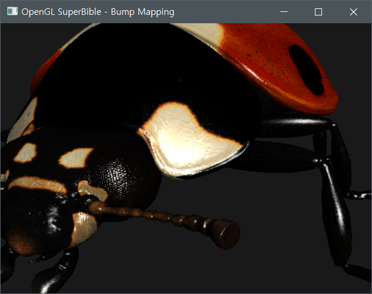

# Chapter 12 : Rendering Technique

## 12.1 Lighting models

빛의 속성을 물리적으로 최대한 정확하게 근사해서 보여주는 고급 모델링도 존재하지만 (Lay-tracing) 실시간 구현에는 무리가 있기 때문에 물리적으로는 정확하지 않더라도 그럴듯한 결과를 보여주는 **근사적인 (속임수)** 방법을 사용하는 것이 일반적이다.

### 12.1.1 Phong Lighting Model

* 가장 일반적인 라이팅 모델 중 하나.
* **Ambient, Diffuse, Specular reflectivity** 등 대체로 세 가지 속성을 가진다. (Diffuse 는 Albedo 와 다르다)

#### Ambient Light

*Ambient Light* 는 특정 방향을 가지지 않는다. 어딘가에 광원은 존재하지만, 광선들이 장면 이곳 저곳에 분산되서 방향이라는 것이 없어지게 될 때, 미세하게나마 빛의 영향을 받는 물체의 색을 말한다. 즉, 앰비언트 라이트는 광원에 적용되는 (직접 영향을 받지 않아도 적용되는) 전역 '밝기' 요소이다.

앰비언트 광원이 최종 색상에 영향을 주는 값을 계산하기 위해서는 해당 메쉬의 **앰비언트 재질 속성을 앰비언트 라이트 값으로 곱하**기만 하면 된다.

#### Diffuse Light

방향이 있는 광원에 영향을 받을 때의 요소를 말한다. 메쉬의 특정 프래그먼트의 **유닛 노멀 벡터 $ \vec N $** 과 해당 프래그먼트에서 빛으로의 **유닛 방향 벡터 $ \vec L $ **을 ***dot product*** 하여 [0, 1] 사이의 값으로 클램핑 한 값을 토대로 Albedo 에 곱하면 최종 Diffuse 값이 나온다.

``` c++
uniform vec3 vDiffuseMaterial;
uniform vec3 vDiffuseLight;
float fDotProduct = max(0, dot(vNormal, vLightDir));
vec3 vDiffuseColor = vDiffuseMaterial * vDiffuseLight * fDotProduct;
```

#### Specular Light 

스페큘러 라이트는 광택 등이 있는 물체에서 빛을 받을 때 **보는 시점과 빛의 방향** 에 따라 광택이 보이거나 안 보이게끔 하는 데 필요한 빛 요소이다. 이런 식으로 만들어지는 더 밝은 부분을 **Specular Highlight** 라고 한다.

*Specular Light* 을 계산하는데는 **유닛 노멀 벡터** $ \vec N $ , **프래그먼트에서 빛의 방향 벡터** $ \vec L $ , 프래그먼트를 반사한 **빛의 반사 벡터** $$ \vec R $$ , 마지막으로 프래그먼트에서 뷰 시점까지의 **역카메라 시점 벡터** $$ \vec V $$ 가 사용된다. 최종적으로는 빛의 반사 벡터 $ \vec R $ 와 역카메라 시점 벡터 $ \vec V $ 의 *dot product* 을 클램핑한 값이 사용되지만, $ \vec R $ 을 생성하는 데는 $ \text{normalize}(\vec N + -\vec{L}) $ 이 계산되어야 한다.

또한 *dot product* 후에 만들어진 값에 대해서, ***Shininess*** 인자를 $ \text{pow}() $ 로 반영해야 한다. 그렇지 않으면 조금이라도 반짝 거릴만한 영역이 죄다 하얀색으로 보이거나 엄청 빛나게 보일 것이다.

``` c++
vec3 viewDir = normalize(viewPos - FragPos);
vec3 reflectDir = reflect(-lightDir, norm);  
float spec = pow(max(dot(viewDir, reflectDir), 0.0), material.shininess_power);
vec3 specular = specular_albedo * material.specular_color * spec;
```

라이팅에 의해 출력되는 최종 색상값은 다음과 같다.

``` c++
color = ambient + diffuse + specular;
```

#### Gouraud Shading

*고라우드 기법* 은 버텍스 쉐이더에서 해당 라이팅을 수행하는 기법이다. 이 경우에는 연산량이 적은 장점이 있지만, 메쉬의 폴리곤이 적거나 할 때는 라이팅이 제대로 수행되지 않을 수도 있는 단점이 존재한다.

#### Phong Shading

*퐁 쉐이딩* 에서는 *고라우드*에서 처럼 최종 라이팅 색상 값을 보간하지 않고, **메쉬의 노멀 벡터, 탄젠트 벡터 등을 보간**한 뒤에 픽셀 단위 (프래그먼트 단위) 로 전체 빛 계산을 수행한다. 이 경우에는 연산량이 높아지는 단점이 있지만 이를 메꾸고도 남을 만큼의 퀄리티 상승이 보장될 수 있다.

오늘날 하드웨어에서는 *Gouraud* 는 거의 안 쓰이고 최소 *Phong* 혹은 *Blinn-Phong* 과 같은 기법이 마지노선으로 쓰인다. 

### 12.1.2 Blinn-phong Lighting

*Blinn-phong lighting* 모델은 퐁 라이팅 모델의 최적화 또는 확장격의 라이팅 구현 방법이라고도 할 수 있다. *Specular light* 을 계산할 때 반사각 $ \vec R $ 을 구해서 $ \vec R \cdot \vec V $ 을 구하지 않고 다음으로 대체할 수 있다.
$$
\vec R \cdot \vec V = \vec N \cdot \vec H \\
\vec H = \frac{\vec L + \vec V}{| \vec L + \vec V |}
$$
기술적으로 퐁 공식을 적용하는 곳이라면 어디든 적용할 수 있다. 이렇게 구현한 *Specular* 빛과 일반 퐁의 *Specular* 빛의 차이가 있을 수도 있는데 그럴 때는 스페큘러 멱승값을 조절하면 거의 비슷하거나 동일한 결과를 얻을 수 있다.

### 12.1.3 Rim lighting

*Rim lighting* 은 뷰 시점과 객체와 광원이 수직을 이루는 상태에서 **사물 주위로 빛이 번지는 현상**을 시뮬레이션 하는 효과이다. 광원이 뒤에 있지 않은 경우에는 쉐이딩에 영향을 주지 않는다. 

림 라이팅이라도 불리는 이유는 광원이 물체의 테두리를 따라서 빛의 테두리가 만들어지기 때문이다.


구현 시 필요한 것은 서피스 노말 벡터 $ \vec N $ 과 물체에서 뷰 시점의 방향 (역뷰 벡터?) $ \vec V $ 이다. 또한 광원 림 라이트의 색과 림 라이트 멱승 값이 필요하다. 어떻게 림 라이트가 계산되는 가 설명하는 것은 쉽기 때문에 넘어간다. 공식은 다음과 같다.
$$
L_{rim} = C_{rim}(1 - \vec{N} \cdot \vec{V})^{P_{rim}}
$$
이를 기존 라이팅 모델에 더하기만 하면 된다.

> 예제는 Chapter12/_1213_rimlight.cc 에서 찾아볼 수 있다.

### 12.1.4 Normal Mapping

> 노멀 맵핑에 대한 또 다른 문서는 OpenGLTutorial 의 Chapter 28. Normal Mapping.md 을 참고한다.

**노멀 맵핑** 은 **Bump mapping** 이라고도 불리는데 더 많은 정점을 메쉬에 추가하지 않고 디테일 정도를 높일 수 있는 방법 중 하나이며 현재에서도 매우 많이 쓰인다. 노멀 맵핑을 구현하려면 각 텍셀의 서피스 노멀을 저장하는 텍스쳐가 필요하며, 이 텍스쳐는 나중에 모델에 적용하여 프래그먼트 쉐이더에서 각 프래그먼트마다의 서피스 노멀을 계산하는데 사용된다.

노말 맵에 가장 일반적으로 사용되는 좌표 공간은 **Tangent space** 이다. 이는 양의 $ z $ 축이 서피스 노멀 방향으로 정렬된 지역 좌표계이며 (즉, 노멀 맵의 텍셀의 모든 값은 광원이 양의 $ z $ 방향에 있을 때를 기준으로 만들어졌다) 이 좌표 공간의 다른 두 벡터는 **Tangent vector, bitangent (이중접선) vector** 이다. 

탄젠트 벡터는 대개 지오메트리 데이터의 일부로 인코딩되서 버텍스 쉐이더의 입력으로 제공되는데, 좌표계에서 **노멀 벡터 및 탄젠트 벡터** 가 주어질 때 **바이탄젠트는 외적으로 구할 수 있다**. (탄젠트는 대개 $ u $ 을 따르고 바이는 $ v $ 을 따른다고 한다)

따라서 노멀, 탄젠트 및 바이탄젠트를 사용해서 일반 좌표계의 있는 벡터를 **Tangent space** 로 변환할 수 있는 매트릭스를 만들 수 있다.
$$
\vec N = \text{unit normal vector} \\
\vec T = \text{unit tangent vector} \\
\vec B = \vec N \cdot \vec T \\ \\
TBN = 
\begin{bmatrix}
\vec{T}.x & \vec{T}.y & \vec{T}.z \\
\vec{B}.x & \vec{B}.y & \vec{B}.z \\
\vec{N}.x & \vec{N}.y & \vec{N}.z
\end{bmatrix}
$$
이렇게 행렬 또는 행렬에 준하는 것을 만들면 카테시안 공간의 어떤 벡터라고 탄젠트 공간으로 변환할 수 있게 된다. 이 것을 사용해서 광원 계산에 사용할 수 있다.

``` c++
vec3 V = P.xyz;
vec3 N = normalize(mat3(mv_matrix) * normal);
vec3 T = normalize(mat3(mv_matrix) * tangent);
// Calculate the bitangent vector (B) from the normal and tangent vectors.
vec3 B = cross(N, T);

// The light vector (L) is the vector from the point of interest to
// the light. Calculate that and multiply it by the TBN matrix.
vec3 L = light_pos - P.xyz;
vs_out.lightDir = normalize(vec3(dot(L, T), dot(L, B), dot(L, N)));

// The view vector is the vector from the point of interest to the
// viewer, which in view space is simply the negative of the position.
// Calculate that and multiply it by the TBN matrix.
V = -P.xyz;
vs_out.eyeDir = normalize(vec3(dot(V, T), dot(V, B), dot(V, N)));
```

#### 예제

> Chapter12/_1214_bumpmapping.cc 을 본다.

##### bumpmapping.vs.glsl

메쉬 모델은 $ \vec N $ 와 $ \vec T $ 을 가진다.

``` c++
layout (location = 1) in vec3 normal;
layout (location = 2) in vec3 tangent;
```

이를 사용해서 $ \vec B $ 을 만들어야 한다. 다만 바이탄젠트를 만들기 이전에, 오브젝트의 방향에 대해서 정렬을 해야하므로 회전 행렬 혹은 해당 오브젝트의 모델 매트릭스를 곱하고, 노멀라이즈 한다.

``` c++
vec3 N = normalize(mat3(mv_matrix) * normal);
vec3 T = normalize(mat3(mv_matrix) * tangent);
```

그 후에, $ \vec B $ 을 외적으로 만든다.

``` c++
vec3 B = cross(N, T);
```

이제, 해당 정점에서의 빛 방향 벡터 $ \vec N $ 을 만들고, 카테시안 공간의 $ \vec N $ 을 탄젠트 공간으로 변환하기 위해 **FBN** 을 적용한다. 다만 실제로 매트릭스를 만들지는 않고 내적과 노멀라이즈를 사용해서 간단히 탄젠트 공간에서의 빛 방향을 만들 수 있다.

``` c++
vs_out.lightDir = normalize(vec3(dot(L, T), dot(L, B), dot(L, N)));
vs_out.eyeDir = normalize(vec3(dot(V, T), dot(V, B), dot(V, N)));
```

라이팅 시뮬레이션이 탄젠트 공간 안에서 이루어지기 때문에 $ \vec V $ 또한 탄젠트 공간으로 변환한다.

##### bumpmapping.fs.glsl

여기서는 `varying` 으로 가져온 탄젠트 공간의 $ \vec N $ $ \vec T $ $ \vec B $ $ \vec V $ $ \vec L $ 을 이용해서 노멀 맵핑에 의한 퐁 라이팅, 림 라이트를 수행한다. 다만 $ \vec N $은 노멀 맵에서의 $ \vec N $ 으로 갈아치운다.

``` c++
vec3 N = normalize(texture(tex_normal, fs_in.texcoord).rgb * 2.0 - vec3(1.0));
```

따라서 다음과 같이 정점을 증가시키지 않고도 디테일이 잘 살아있는 라이팅 시뮬레이션 결과를 얻을 수 있다.



### 12.1.5 Environment Mapping (Reflection Mapping)

> https://opentutorials.org/course/2221/12595

일반 라이팅 쉐이더는 매우 복잡해질 가능성이 있으며, 임의의 환경에 대해서 동작하는 공식을 만드는 것은 거의 불가능하다. 이 때 필요한 것이 ***Environment Mapping*** 이다. 실시간 그래픽스 프로그램에서 사용되는 *환경 맵핑* 에는 몇 가지 종류가 있다.

1. [구 환경 맵핑](https://en.wikipedia.org/wiki/Sphere_mapping)

   시뮬레이션된 주위 사물에 의해 조명을 받는 **반구** 형태의 이미지로 표현한다. 직관적이고 신속하게 환경 맵을 만들 수 있지만 360 도 전체를 시뮬레이션 할 수는 없다.

2. [정방 환경 맵핑(equirectangular map)](https://en.wikipedia.org/wiki/Equirectangular_projection)

   이퀴렉텡귤러 맵은 반구에서 더 나아가서 360 도 전체를 시뮬레이션 할 수 있도록 구성된 **사각형 맵** 이다. 

3. [큐브 환경 맵](https://en.wikipedia.org/wiki/Cube_mapping)

   큐브 맵은 가운데에서 밖으로 주위를 볼 수 있는 박스 안에 있다고 가정하고, 이 박스를 표현하는 **6 개의 면**으로 구성된 특수한 텍스쳐를 이용해서 환경을 맵핑하는 방법이다.

#### A. **Spherical Environment Map**s


*구 환경 맵* 은 시뮬레이션할 재질에 대해서 주위 환경으로 만들어지는 맵을 사용해 라이팅을 표현하는 텍스쳐 맵이다. 쉐이딩 되는 지점에 대해 뷰 방향 $ \vec V $ 과 서피스 노멀 $ \vec N $ 을 구한 다음에 두 방향으로 만들어지는 노멀라이즈된 리플렉션 벡터 $ \vec R $ 을 만들고, 텍스쳐 좌표를 계산해서 해당 프래그먼트에 쏴줄 컬러를 얻는다.

구 환경 맵은 대체로 이런 식으로 되어 있다.


구 환경 맵을 맵핑하는 방법은 다음과 같다.

##### 방법

1. $ \vec V $ 와 $ \vec N $ 을 사용해서 반사 벡터 (방향) $ \vec R $ 을 도출한다.

2. $ \vec R $ 을 사용해서 스케일 인자 $ m $ 을 계산한다.
   $$
   m = 2\sqrt{\vec R_x^2 + \vec R_y^2 + (\vec R_z + 1)^2}
   $$

3. 마지막으로, 최종 텍셀 위치를 구한다.
   $$
   s = \frac{\vec R_x}{m} + 0.5 \\
   t  = \frac{\vec R_y}{m} + 0.5
   $$


##### 예시

> Chapter12/_1215_spherical.cc 을 찾아볼 것

###### render.fs.glsl 에서...

``` c++
// Reflect u about the plane defined by the normal at the fragment
vec3 r = reflect(u, normalize(fs_in.normal));

// Compute scale factor
r.z += 1.0;
float m = 0.5 * inversesqrt(dot(r, r));

// Sample from scaled and biased texture coordinate
color = texture(tex_envmap, r.xy * m + vec2(0.5));
```

결과는 다음과 같다.


#### B. Equirectangle Environment Mapping

> https://www.slideshare.net/yorung/360vr

*이퀴렉탱글러 맵* 은 구 환경 맵과 유사하지만, 360 도 전방위 환경의 정보를 반영할 수 있다는 것이 장점이다. 그리고 구의 극단에서 샘플링할 때 생기는 텍스쳐가 늘어나는 현상이 눈에 덜 띈다. 


$$
tc := \text{Texel which has x, y component [0, 1]} \\
\text{Phase 1} \\
tc_t = \vec R_y \\
tc_s = \text{normalize}(\vec R \text { which y component is 0}).x * \frac{1}{2} \\
\text{Phase 2} \\
s := \text(sign)(\vec R.z) * \frac{1}{2} \\
tc_s = 0.75 - s (\frac{1}{2} - tc_s) \\
tc_t = 0.5 + tc_t\frac{1}{2}
$$

#### C. Cube Environment Map

> 자세한 설명은 OpenGL Tutorial/Chapter 17. Cubemaps 에서 볼 수 있다.

### 12.1.6 **Material Properties** 

지금까지는 전체 모델에 대해서 단일 재질을 사용했지만, 실제 어플리케이션에서는 모든 모델이 단일 재질을 가질리가 없을 뿐더러 여러 가지 재질을 가지고 있기 때문에 이런 사항들을 전부 고려해야 한다. 서피스 마다의 재질 속성을 할당할 수 있을지도 모르고, 텍스쳐에 서피스 정보를 저장하게 할 수도 있다. 또한 스페큘러 멱승 지수를 다르게 해서 흐리게 하거나 좀 더 밝게 할 수도 있을 것이다.

모델의 거칠기 정도 등도 각 오브젝트마다 제각각 다를 것이다. 이런 거칠기를 조절할 수 있는 방법 중 하나는 환경 맵을 미리 **블러** 시켜서 텍스쳐로 저장해, 광택 인자로 사용하게 해서 맵의 선명한 버전에서 블러된 버전으로 점진적으로 변화시키게 할 수 있기도 하다.

해당 예제에서는 다음과 같은 환경 맵과 광택 맵 (***Shininess Map***) 을 사용할 것이다.


*광택 맵* 에서 텍셀이 지정한 부분이 $ 0 $ 이라면 블러된 환경 맵을, $ 1 $ 이라면 블러되지 않은 환경 맵을 사용하기로 했다.

##### 예제

> Chapter12/_1216_glossy.cc 을 참고할 것.

### 12.1.7 Shadow Mapping

> 자세한 설명은 OpenGL Tutorial/Chapter 25. Shadow Mapping 을 참고할 것.

그림자 계산에 있어서 가장 중요한 점은 **관심 지점에 빛이 도달하는가**를 결정하는 것이다. 쉐이딩되는 점에서 라이트까지 장애물이 없는 지를 결정해야 한다. 이 과정을 자연스럽게 하는 버퍼가 있는데, 깊이 버퍼가 바로 그 예이다.

그림자 매핑은 **광원의 시점에서 장면을 렌더링하여 정보를 만드는 기법**이다. 깊이 정보만 필요하며, 따라서 오프스크린이 자연스레 따라오고 깊이 어태치먼트만 있는 프레임 버퍼를 만들어서 사용해야 한다. 

> Chapter 25. Shadow Mapping 에서 발췌...
>
> 우선 World 공간의 좌표 $$ \overline{P} $$ 가 그림자에 위치해 있는가를 확인할려면, $$ \mathbf{T} $$ 을 곱해 빛의 시점에서 Depth value 가 사상된 위치의 Depth value 보다 큰 지 (그림자에 위치해 있는지), 아니면 작은 지 (빛의 영향을 받고 있는지) 를 확인해야 한다. 그럴려면 Vertex Shader 에서 Model matrix 에 사상된 각 정점 $$ \overline{P} $$ 을 $$ \mathbf{T} $$ 와 곱한 뒤에 Fragment Shader 로 보낸다. 그리고 이 보낸 좌표 값을 Depth Map 의 텍셀의 값과 비교해서 그림자인가 아닌가를 반환한다. 이 반환한 값을 *Diffuse 및 Specular* 에 곱해서 적용하면 기본적인 그림자가 만들어진다.
>
> 다만 여기서 주의해야 할 점은, Orthogonal Perspective 에서는 $$ \mathbf{T} $$ 에 의해서 변형된 모든 값 (Clipping 제외)이 $$ [-1, 1] $$ 사이에 있기 때문에 파이프라인 단계에서 Clip space 로 변형 시 $$ w $$ 축 값으로 $$ x,y,z $$ 을 나눠주는 것을 명시적으로 할 필요는 없다는 점이다. 그러나 일반 점 조명 (Point light) 혹은 Specular light 와 같은 경우에는 이 과정이 별도로 필요하다.
>
> 그리고 $$ fragPosLightSpace $$ 의 값은 $$ [-1, 1] $$ 값 사이인데, Depth map 의 좌표는 $$ [0, 1] $$ 사이이고 Depth value 역시 $$ [0, 1] $$ 의 범위를 가지므로 간단한 맵핑이 다시 필요하다.

이와 같은 연산은 그래픽스에서 매우 흔한 연산이기 때문에, OpenGL 은 [***Shadow Sampler***](https://www.khronos.org/opengl/wiki/Sampler_(GLSL)#Shadow_samplers) 을 지원하고 있다. GLSL에서는 2D 텍스쳐에 대한 섀도우 샘플러를 `sampler2DShadow` 타입의 변수로 선언하며, 그 외의 영우에 `sampler1DShadow` `samplerCubeShadow` `samplerRectShadow` 와 같은 샘플러를 생성할 수 있다. 각 타입에 대한 배열 역시 생성할 수 있다.

>https://renderman.pixar.com/resources/RenderMan_20/softShadows.html
>http://fabiensanglard.net/shadowmappingPCF/index.php
>https://stackoverflow.com/questions/15250380/what-are-shadow-samplers-in-opengl-and-what-are-possible-uses-for-them

#### Example

> Chapter12/_1217_shadow.cc 을 참고한다.

`GL_DEPTH_COMPONENT32F` 와 같은 깊이 버퍼 타입을 가지는 $ z $ 버퍼 텍스쳐를 실제 렌더링 쉐이더에서 그림자를 만들어 내고자 할 때는 그냥 `GL_TEXTURE0` `GL_TEXTURE_2D` 와 같은 타깃으로 바인딩하면 된다. 다만 무사히 잘 넘어가기 위해서는 실 렌더링 쉐이더의 바인딩 포인트 샘플러가 *Shadow Sampler* 형이어야 한다. 여기서는 `sampler2DShadow` 을 사용했다.

``` c++
// Depth buffer
glGenTextures(1, &depth_texture);
glBindTexture(GL_TEXTURE_2D, depth_texture);
glTexStorage2D(GL_TEXTURE_2D, 1, GL_DEPTH_COMPONENT32F, DEPTH_TEXTURE_SIZE, DEPTH_TEXTURE_SIZE);
glTexParameteri(GL_TEXTURE_2D, GL_TEXTURE_MIN_FILTER, GL_LINEAR);
glTexParameteri(GL_TEXTURE_2D, GL_TEXTURE_MAG_FILTER, GL_LINEAR);
glTexParameteri(GL_TEXTURE_2D, GL_TEXTURE_COMPARE_MODE, GL_COMPARE_REF_TO_TEXTURE);
glTexParameteri(GL_TEXTURE_2D, GL_TEXTURE_COMPARE_FUNC, GL_LEQUAL);
```

이 때 $ z $ 버퍼로 쓰일 텍스쳐는 나중에 그림자 렌더링시 `textureProj` 함수를 쓰기 위해 특정한 옵션을 더 설정해줘야 한다. 그것이 바로 `GL_TEXTURE_COMPARE_MODE` `GL_TEXTURE_COMPARE_FUNC` 이고, 고정 함수 형태로 제공된다.

마지막으로 유저 시점에서 광원 시점에서 생성된 $ z $ 버퍼의 값을 가져오기 위해서는, 위치 값을 **그림자 행렬**로 변환해서 해당 $ z $ 값이 그림자 버퍼의 $ z $ 값보다 큰 지 작은 지를 판별해야 한다. 큰 경우에는 그림자가 생기며 작은 경우에는 그림자가 생기지 않을 것이다.

**그림자 행렬 (Shadow Matrix)** 는 NDC 로 투영까지 시켜주기 때문에 ( $ T = PV $ 에서 맨 앞에 * 0.5 + 0.5 까지 더 한 것이 그림자 행렬) 따로 NDC 값으로 정리해줄 필요가 없다. 또한 이 투영 과정은 GLSL 에서 다음 함수로 제공한다.

``` c++
float textureProj( 	sampler2DShadow sampler,
  	vec4 P,
  	[float bias]);
```

> https://www.khronos.org/registry/OpenGL-Refpages/gl4/html/textureProj.xhtml

이 함수는 쉐이더를 쓸 때 설정한 고정 함수에 의해서 $ z $ 요소와 비교한 뒤에, 테스트가 성공했는가 실패했는가를 각각 1.0 또는 0.0 으로 반환한다. 만약 대상이 되는 텍스쳐가 `GL_LINEAR` 혹은 멀티 샘플을 수행하고 있을 경우에는 각 샘플에 대해 수행해서 평균을 낸다. 지금 예제의 경우에는 고정 함수가 `GL_LEQUAL` 이므로 $ z $ 값이 버퍼의 $ z $ 값보다 작거나 같으면 1, 아니면 0 을 반환할 것이다.

만약 무아레 현상이 일어나면, $ z $ 버퍼를 갱신하는 쉐이더를 쓸 때 `glPolygonOffset()` 함수를 써서 무아레를 방지하게 할 수도 있다. 

다음은 매우 간략화된 그림자 매핑 프래그먼트 쉐이더의 코드이다.

``` c++
#version 430 core
layout (location = 0) out vec4 color;
layout (binding = 0) uniform sampler2DShadow shadow_tex;

in VS_OUT {
    vec4 shadow_coord;
} fs_in;

void main() {
    diffuse_specular = CalculateColor();
    color = ambient + texutureProj(shadow_tex, fs_in.shadow_coord) * diffuse_specular;
}
```

#### 덤

그림자 맵은 장점과 단점이 공존한다. 각 광원이 **자신만의 $ z $ 맵을 가져야 하기 때문에 메모리 소비가 매우 크다.** 또한 각 라이트는 장면을 따로 렌더링해야하기 때문에 성능에도 영향을 미칠 수 있다. 그리고 그림자 맵의 단일 텍셀이 실제 광원 계산에 수행되는 화면 좌표 상의 정확도를 유지해야 하기 때문에 고해상도의 $ z $ 버퍼 텍스쳐가 필요할지도 모른다. 그렇지 않으면 지글거림 (Shadow acne) 가 일어날 수도 있다. 

*Shadow acne* 가 일어나는 경우에는 `glPolygonOffset` 을 사용해서 지글거림 현상을 제거할 수도 있다. 일단 위 함수를 설정했다면 (스케일 인자를 설정) `glEnable(GL_POLYGON_OFFSET_FILL)` 을 사용해서 효과를 활성화시켜야 한다. 물론 깊이 값을 계산할 때만 설정해야 하며 계산이 끝난 후에는 `glDisable` 을 사용하자.

결과는 Result/Opengl_Sb6/_1217 을 보면 알 수 있다.

### 12.1.8 Fog


## 12.2 Non-Photo-Realistic Rendering (NPR)

지금까지는 현실을 모방한 무언가 그럴싸한 것들을 렌더링해왔다면, 이 절에서 다룰 것들은 연필 스케치 효과나 완전히 추상적인 방식을 사용해서 렌더링할 것이다. 이런 현실적이지 않은 렌더링 기법들을 **NRP** 이라 한다. (약어)

### 12.2.1 Cel Shading 

> Cell 이 아니다!


대부분의 텍스쳐 매핑 예제에서, 2D 텍스쳐를 사용했지만 Cell shading 에서는 대개 ***1차원의 텍스쳐***를 사용한다. 이 방식은 컴퓨터 게임에서 만화 풍으로 렌더링할 지오메트리를 묘화할 때 자주 사용되는 기법이다. 다른 용어로 ***Toon shading*** 이라고 하기도 한다.

이 방식의 주요 요점은 1차원 텍스쳐 맵 (`GL_TEXTURE_1D`) 을 *look-up table* 로 사용해서 텍스쳐 맵에서 읽어온 단일 색상(`GL_NEAREST`) 으로 지오메트리를 칠하는 것이다.

기본 개념은 뷰 공간에서의 **Diffuse Light Intensity** ($ \vec N \cdot \vec L $) 을 1D 텍스쳐 좌표로 사용해서 색상 테이블을 `texelFetch` 혹은 `texture` 로 호출해서 텍스쳐로 참조하는 것이다.

#### 예제

> Chapter12/_1221_cellshading.cc 을 참고한다.

##### startup()

프레임버퍼는 필요없다. 그저 색을 담아둘 `GL_NEAREST` 의 `GL_TEXTURE_1D` 버퍼만 필요하다. 따라서 다음과 같이 색상을 만들고, 텍스쳐를 만들어서 `GL_TEXTURE_1D` 타깃에 바인딩한다.

``` c++
constexpr GLubyte toon_tex_data[] = {
    0x22, _0x00, 0x44, _0x00, 
    0x66, _0x00, 0x88, _0x00, 
    0xAA, _0x00, 0xCC, _0x00,
    0xFF, _0x00,
};

glGenTextures(1, &tex_toon);
glBindTexture(GL_TEXTURE_1D, tex_toon);
constexpr int count = sizeof(toon_tex_data) / 4; // 7.
// GL_RGB8 has 32bits, 
// width : Specifies the width of the texture, in texels (not byte unit, but count).
glTexStorage1D(GL_TEXTURE_1D, 1, GL_RGB8, count);
glTexSubImage1D(GL_TEXTURE_1D, 0, 0, count, GL_RGBA, GL_UNSIGNED_BYTE, toon_tex_data);

// Important (GL_NEAREST)
glTexParameteri(GL_TEXTURE_1D, GL_TEXTURE_MAG_FILTER, GL_NEAREST);
glTexParameteri(GL_TEXTURE_1D, GL_TEXTURE_MIN_FILTER, GL_NEAREST);
glTexParameteri(GL_TEXTURE_1D, GL_TEXTURE_WRAP_S, GL_CLAMP_TO_EDGE);
```

> 대개 툰 쉐이딩을 할 때는 4 색 혹은 7 색 단계의 밝기가 자주 쓰인다고 한다.

##### toonshading.fs.glsl

`texture` 함수를 사용해서 `sampler1D` 의 룩업 테이블을 조회한다. 여기서는 Diffuse 만 고려하기 때문에 간단하게 코드가 작성된다.

``` c++
uniform sampler1D tex_toon;

// Simple N dot L diffuse lighting
float tc = pow(max(0.0, dot(N, L)), 5.0);
// Sample from cell shading texture
color = texture(tex_toon, tc) * (tc * 0.8 + 0.2);
```

만약 Ambient, Diffuse, Specular 까지 전부 다 고려할 예정이라면 회색조의 룩업 테이블만 두고 해당 룩업 테이블을 조회해서 원래 색상에 *multiply* 로 반영하면 툰 쉐이딩을 적용한 퐁 라이팅 모델을 구현할 수 있지 않을까 싶다.

결과는 Results/OpenGL_Sb6/_1221.mp4 에서 볼 수 있다.

