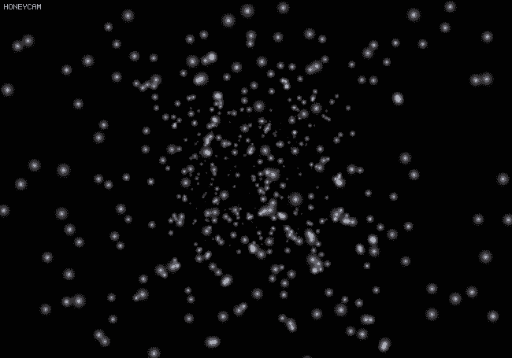

# Chapter 9 :: Fragment Processing & Framebuffer

## 9.6 고급 프레임버퍼 포맷

윈도우 시스템에서 제공하고 있는 기존 프레임 버퍼나, 사용자 정의 프레임 버퍼에 텍스쳐를 렌더링 할 때는 대개 컬러 버퍼의 *type* 이 `GL_RGBA8` 와 같은 각 채널 당 $ N $ 비트 정수형 포맷으로 구성된다. 하지만 쉐이더에서는 컬러 값을 출력할 때, `vec4 float` 으로 넘기는 걸 자연스럽게 확인할 수 있다.

사실 OpenGL 은 프레임버퍼의 각 버퍼의 픽셀 타입을 *부동소수점 형태, 정수형, 음수, 8비트보다 큰 수* 등으로 설정해서 값을 갱신하도록 할 수 있다.

### 9.6.1 Rendering without any attachment

프레임버퍼를 하나 생성해서, *아무것도 어태치 시키지 않고* 쉐이더를 사용하는 것도 가능하다. 하지만 이 경우에는 출력된 데이터가 저장될 곳이 없기 때문에 폐기된다. 하지만 프래그먼트 쉐이더는 그냥 텍스쳐 버퍼에 쓰는 것 외에도 **`imageStore()`** 와 같은 내장 함수를 사용해서 지정된 이미지 (`gimage`) 에 텍셀의 값을 저장할 수도 있고 *atomic* 한 연산을 사용해서 카운터를 증가시키거나 감소할 수도 있다.

> imageStore
> https://www.khronos.org/registry/OpenGL-Refpages/gl4/html/imageStore.xhtml
> https://computergraphics.stackexchange.com/questions/4388/binary-scene-voxelization-using-imagestore-problem
>
> atomicCounterIncrement
> https://www.khronos.org/registry/OpenGL-Refpages/gl4/html/atomicCounterIncrement.xhtml
> http://www.geeks3d.com/20120309/opengl-4-2-atomic-counter-demo-rendering-order-of-fragments/

보통 렌더링을 할 때, 바인딩 된 프레임 버퍼에서는 하나 이상의 어태치먼트에 바인딩 된 버퍼의 *최대 넓이, 높이, 레이어 수, 샘플 개수* 등을 가져와서 렌더링하는데 정보로 쓴다. 이런 속성들은 뷰포트를 정의하는 크기 등 여러가지 설정에서 쓰일 수 있다.

#### A. Functions

하지만 프레임버퍼에서 **Attachment 가 없다면, 텍스쳐 메모리의 양의 제한이 없어질 수 있다.** 그러나 해당 프레임버퍼는 이 정보를 다른 곳으로부터 얻어와야 한다. 

각 프레임버퍼 객체는, Attachment 가 없으면 **인자 값을 직접 설정**해줘야 한다. 이런 인자들을 수정하기 위해서는 다음과 같은 함수를 사용한다.

```c++
void glFramebufferParameteri(GLenum target, GLenum pname, GLint param);
```

- `target` : 어떤 프레임버퍼 객체가 바인딩이 될지 결정한다. `GL_FRAMBUFFER` `GL_DRAW_` `GL_READ_` 등이 바인딩될 수 있다. 이 때 일반 인자는 `_DRAW_` 와 동일하다는 것을 알아두자.

- `pname` : 어떤 인자를 변경할지 지정한다.

  > 인자는 다음 주소에서 찾아볼 수 있다.
  > https://www.khronos.org/registry/OpenGL-Refpages/gl4/html/glFramebufferParameteri.xhtml

- `param` : 해당 인자에 대해 변경할 값을 지정할 수 있다.

어태치먼트가 없는 프레임버퍼의 최대 크기는 매우 커질 수 있다. 왜냐면 실제로 렌더링할 어태치먼트가 없기 때문이다.

#### B. Example

다음은 예시 코드이다. 프레임버퍼를 하나 생성해서, 가상으로 10000 x 10000 의 버퍼가 있다고 알리는 코드이다.

```c++
glGenFramebuffers(1, &m_fbo);
glBindFrameBuffer(GL_FRAMEBUFFER, m_fbo);
glFramebufferParameteri(GL_FRAMEBUFFER, GL_FRAMEBUFFER_DEFAULT_WIDTH, 10'000);
glFramebufferParameteri(GL_FRAMEBUFFER, GL_FRAMEBUFFER_DEFAULT_HEIGHT, 10'000);
```

이렇게 하면 `gl_FragCoord` 의 변수의 요소 $ (x, y) $ 는 $ 0 $ 에서 $ 9,999 $ 까지 될 것이다.

### 9.6.2 floating-point framebuffer

프레임버퍼에서 부동소수점 포맷의 어태치먼트를 사용하게 할 수도 있다. 사실, OpenGL 렌더링 파이프라인은 내부적으로 부동소수점 데이터와 잘 작동하지만 원본과 타깃은 기껏해야 고정소수점 포맷을 사용한다. 따라서 최종적으로는 모든 값이 $ 0 $ 에서 $ 1 $ 사이로 고정된다.

그래서 컬러 (색상) 및 쉐이딩에 일반 32비트 부동소수점을 사용하게 할 수도 있다. 하지만 만약 색상 당 8비트만을 지원하는 모니터에서 렌더링하게 되면 고정 소수점으로 맵핑이 되면서 값 정보가 날아가버린다. 그렇지만 **부동소수점 정밀도로 텍스쳐에 렌더링하거나, 부동 데이터가 고정 소수점 출력 포맷에 어떻게 매핑되는지도 제어할 수 있다.**

이렇게 부동소수점 포맷을 이용해서 렌더링을 실시하는 행위를 ***HDR(High dynamic-range)*** 이라고 한다.

#### A. 부동소수점 포맷 사용하기

부동소수점 포맷의 버퍼를 사용하기 위해서는 `glTexStorage2D` 와 같은 함수에서 내부 포맷을 `GL_RGBA32F` `GL_RGBA16F` 와 같은 것으로 생성하면 된다.

```c++
glTexStorage2D(GL_TEXTURE_2D, 1, GL_RGBA16F, width, height);
glTexStorage2D(GL_TEXTURE_2D, 1, GL_RGBA32F, width, height);
```

여기서 부동소수점 포맷은 *suffix* `F` 가 붙음을 알아야 한다.

> 다음 주소에서 부동소수점 포맷 리스트를 확인할 수 있다.
> https://www.khronos.org/registry/OpenGL-Refpages/es3.0/html/glTexImage2D.xhtml

#### B. HDR (high dynamic range)

*HDR* 을 사용해서 *light bloom, lens flare, light reflection, light refaction, sunset light, dust, particle* 등의 여러 고급 효과들을 구현할 수 있다. 부동소수점 버퍼에 대한 *HDR* 은, **밝은 부분을 밝게, 어두운 부분을 더 어둡게 하면서도 디테일을 함께 볼 수 있**도록 한다. 

단일 이미지에 어둡고 밝은 영여에 대해서 모든 디테일을 저장할 수 있는 것은 부동소수점 데이터를 사용하기 때뭉니다. 하지만 이 부동소수점의 이미지를 0 에서 255 의 값으로 표시되는 동적 이미지로 생성할려면 (트루컬러) ***tone mapping*** 을 사용해서 수행할 수 있다.

#### C. Tone mapping

일반 컴퓨터에서는 부동소수점 데이터를 디스플레이에 표현할 수 없기 때문에 표시할 수 있는 색상으로 **Tone mapping** 을 수행해야 한다. *Tone Mapping* 은 일련의 색상 데이터를 다른 색상 데이터 혹은 다른 색상 공간으로 옮기는 작업을 말한다.

#### D. Tone mapping example

> Chapter9/_962_hdr_tonemap.cc 을 참고한다.

이 예제에서는 HDR 정보를 가지고 있는 사진을 트루컬러로 변환하는 3 가지 방법을 테스트한다. 첫 번째 방법은 그냥 색을 곧이 곧대로 보여주는 것이며 결과적으로 $ 0 $ 에서 $ 1 $ 까지의 값을 가지지 않는 색상은 잘려서 디테일이 다 날아갈 것이다.

```c++
// tonemap_naive.fs.glsl
color = texture(s, 2.0 * gl_FragCoord.xy / textureSize(s, 0));
```

두 번째 예제는 *노출 (exposure)* 이라는 개념을 적용시켜서 최종 색상을 반영하도록 한다. 노출이 낮으면 매우 밝은 부분의 디테일이 보이지만 어두운 영역의 디테일은 사라진다. 반대로 노출이 높으면 매우 밝은 영역은 디테일이 사라지나 어두운 영역의 디테일은 살아난다. 

```c++
// tonemap_exposure.fs.glsl
c.rgb = vec3(1.0) - exp(-c.rgb * exposure);
```

여기서 노출 $ x $ 에 대해 최종 결정되는 색상의 값은 다음과 같다.
$$
f(\text{color}') = 1 - \exp^{-x(\text{color})}
$$
마지막 예제는 *Adaptive* 하며 장면의 다른 부분에 대한 상대적인 밝기에 기반해 각각의 텍셀의 노출 레벨을 **동적으로 조정**한다. 프래그먼트 쉐이더에서 임의 *Texel* 주위의 25 개의 텍셀의 밝기를 측정한 뒤에, 가중치를 더해서 텍셀의 최종 노출값을 결정한다.

```c++
// tonemap_adaptiv.fs.glsl   
for (i = 0; i < 25; i++) {
    vec2 tc = (2.0 * gl_FragCoord.xy + 3.5 * vec2(i % 5 - 2, i / 5 - 2));
    vec3 col = texture(hdr_image, tc * tex_scale).rgb;
    lum[i] = dot(col, vec3(0.3, 0.59, 0.11));
}

float kernelLuminance = (
    (1.0  * (lum[0] + lum[4] + lum[20] + lum[24])) +
    (4.0  * (lum[1] + lum[3] + lum[5] + lum[9] +
            lum[15] + lum[19] + lum[21] + lum[23])) +
    (7.0  * (lum[2] + lum[10] + lum[14] + lum[22])) +
    (16.0 * (lum[6] + lum[8] + lum[16] + lum[18])) +
    (26.0 * (lum[7] + lum[11] + lum[13] + lum[17])) +
    (41.0 * lum[12])
) / 273.0;
float exposure = sqrt(8.0 / (kernelLuminance + 0.25))
```

이렇게 해서 트루컬러 이상의 정보를 가지는 파일의 디테일을 전부 다 살릴 수 있게 되었다.

#### E. Bloom effect

> Chapter9/_962_hdr_bloom.cc

*HDR* 을 사용해서 적용할 수 있는 효과 중 하나는 [***Bloom*** 이펙트](https://en.wikipedia.org/wiki/Bloom_(shader_effect))이다. (환하게 번지는 효과) 게임이나 영상을 보면 태양 또는 밝은 라이트가 자신과 광원 사이의 나뭇가지나 다른 객체를 에워싸는 것을 볼 수 있는데, 이것이 바로 **Light bloom effect** 이다. 

예제는 생각외로 매우 까다롭다. 개략젹으로 말하면 다음 순서로 이미지를 렌더링한다.

1. 부동소수점을 받는 컬러 버퍼를 2 개 생성한다. 하나는 일반 렌더링용이고 하나는 경계점 컬러를 저장한다.
2. 각 공에 대해서 *ambient* *diffuse* *specular* 컬러를 저장한다. 32 개 있으니 32 개 저장한다.
3. 라이팅을 구현하기 위한 쉐이더 코드를 짠다. 또한 $ P $ $ V $ $ M $ 매트릭스 모델 전부 준비한다. 총 34 개의 매트릭스가 필요하다.
4. 렌더링을 한다. 컬러 버퍼 2 개에 렌더링된 결과물이 생성된다.
5. 이제 후처리 작업을 할 것이므로 깊이 테스트를 끈다.
6. 필터링 부분에서는 경계점 컬러가 저장된 버퍼를 가우시안 필터를 적용하기 위해 2 개의 프레임버퍼를 만들고 서로 도치된 사이즈의 버퍼를 만들어 바인딩한다.
7. 각 프레임 버퍼와 필터링 쉐이더를 사용해 빠른 가우시안 필터를 적용한다.
8. 마지막으로 기본 프레임버퍼에 기존 렌더링 이미지와 가우시안이 적용된 버퍼를 적용해서 최종 이미지를 만든다.

##### InitializeRenderFrameBufferObject(render_fbo)

부동소수점 `GL_RGBA16F` 을 포맷으로 가지는 `scene` 와 `brightpass` 컬러 텍스쳐를 만들어서, 컬러 버퍼로 어태치먼트 한다. (물론 $ z $ 버퍼도 만든다)

```c++
glGenTextures(1, &tex_scene);
glBindTexture(GL_TEXTURE_2D, tex_scene);
glTexStorage2D(GL_TEXTURE_2D, 1, GL_RGBA16F, MAX_SCENE_WIDTH, MAX_SCENE_HEIGHT);
glFramebufferTexture(GL_FRAMEBUFFER, GL_COLOR_ATTACHMENT0, tex_scene, 0);

glGenTextures(1, &tex_brightpass);
glBindTexture(GL_TEXTURE_2D, tex_brightpass);
glTexStorage2D(GL_TEXTURE_2D, 1, GL_RGBA16F, MAX_SCENE_WIDTH, MAX_SCENE_HEIGHT);
glFramebufferTexture(GL_FRAMEBUFFER, GL_COLOR_ATTACHMENT1, tex_brightpass, 0);
```

그 후에 프레임버퍼에 어태치먼트한 컬러 버퍼들에 렌더링할 수 있도록 `glDrawBuffers` 로 설정해준다.

```c++
constexpr GLenum buffers[] = { GL_COLOR_ATTACHMENT0, GL_COLOR_ATTACHMENT1 };
glDrawBuffers(2, buffers);
```

##### startup()

첫 렌더링 버퍼를 만들었으면, 가우시안 필터링을 위한 버퍼를 2개 만든다. 가로, 세로에 대해 25 개의 텍셀에 대해 번짐 효과를 구현해야 하며 쉐이더를 하나만 쓰는 것이 좋기 때문에 프레임 버퍼를 $ 2 $ 개 만들고, 바인딩되는 컬러 텍스쳐의 크기를 가로, 세로가 서로 뒤바뀐 형태로 만든다.

```c++
glGenFramebuffers(2, &filter_fbo[0]);
glGenTextures(2, &tex_filter[0]);
for (auto i = 0; i < 2; i++) {
    glBindFramebuffer(GL_FRAMEBUFFER, filter_fbo[i]);
    glBindTexture(GL_TEXTURE_2D, tex_filter[i]);
    glTexStorage2D(GL_TEXTURE_2D, 1, GL_RGBA16F, 
        i ? MAX_SCENE_WIDTH : MAX_SCENE_HEIGHT, i ? MAX_SCENE_HEIGHT : MAX_SCENE_WIDTH);
    glFramebufferTexture(GL_FRAMEBUFFER, GL_COLOR_ATTACHMENT0, tex_filter[i], 0);
    glDrawBuffers(1, buffers);
}
```

마지막으로 Uniform buffer object 을 만든다. 그 안에는 $ 32 $ 개의 오브젝트의 매트릭스와 $ P $ $ V $ 매트릭스가 갱신된다.

```c++
glGenBuffers(1, &ubo_transform);
glBindBuffer(GL_UNIFORM_BUFFER, ubo_transform);
glBufferData(GL_UNIFORM_BUFFER, (2 + SPHERE_COUNT) * sizeof(vmath::mat4), NULL, GL_DYNAMIC_DRAW);
```

##### InitializeColorOfBalls()

이 함수에서는 `ubo_material` 을 `glMapBufferRange` 함수로 주소를 가져와서 컬러 값 맵핑을 시도한다. 각 오브젝트 당 참조가 되는 구조체는 `material` 구조체인데 `hdrbloom-scene.fs.glsl` 의 블록 구조체 `material_t` 와 배치가 동일하다.

```c++
struct material_t {
    vec3    diffuse_color;
    vec3    specular_color;
    float   specular_power;
    vec3    ambient_color;
};

layout (binding = 1, std140) uniform MATERIAL_BLOCK {
    material_t  material[32];
} materials;
```

##### render(double currentTime)

렌더링에서는 맨 먼저 프레임버퍼에 두 개의 부동소수점 버퍼가 있는 것을 바인딩하고, `program_render` 쉐이더 프로그램을 사용해서 렌더해야 한다. 여기서 실제 DEPTH_TEST 가 있기 때문에 해당 부동소수점 두 버퍼를 초기화시켜줘야 한다.

```c++
glBindFramebuffer(GL_FRAMEBUFFER, render_fbo);
glClearBufferfv(GL_COLOR, 0, black); // GL_COLOR_ATTACHMENT0 of render_fbo
glClearBufferfv(GL_COLOR, 1, black); // GL_COLOR_ATTACHMENT1 of render_fbo
glClearBufferfv(GL_DEPTH, 0, &one);  // GL_DEPTH_COMPONENT32F of render_fbo
```

##### render -> UpdateTransformMatrixes(ubo_transform, t)

`ubo_transform` 유니폼 버퍼의 매트릭스 값을 새로 갱신한다. 여기서 참조가 되는 구조체는 `DTransformT` 구조체이며 `hdrbloom-scene.vs.glsl` 의 `TRANSFORM_BLOCK` 와 배치가 동일하다.

```c++
layout (binding = 0, std140) uniform TRANSFORM_BLOCK {
    mat4    mat_proj;
    mat4    mat_view;
    mat4    mat_model[32];
} transforms;
```

##### render(double currentTime)

그리고 `GL_COLOR_ATTACHMENT1` 에 저장할 색상 값을 골라내기 위해 `bloom_thresh_min` `max` 을 유니폼 변수로 갱신한다. 이 값 밖에 있는 밝기를 가진 색상 값은 완전한 검은색으로 갱신될 것이다.

```c++
// Threshold color based on its luminance and write it to
// the second output
color = color * 4.0 * smoothstep(bloom_thresh_min, bloom_thresh_max, Y);
color1 = vec4(color, 1.0);
```

여기서 glsl 에서 제공하는 함수인 `smoothstep` 은 두 값 사이에 perform Hermite interpolation between two values 한다.


이제 `GL_COLOR_ATTACHMENT1` 에 생성된 밝은 값 텍스쳐에 가우시안 블러를 쓰기 위해 `DrawFilterWithGaussian()` 을 호출한다.

##### DrawFilterWithGaussian()

분리 가능한 가우시안 필터를 사용해서 가우시안을 적용한다. 분리 가능 필터는 두 패스로 분리할 수 있는 필터를 말한다. 일반적으로 수평축과 수직축에 하나씩 사용된다. 이 코드에서는 각 차원에 대해 $ 25 $ 개의 탭을 사용하는데, 필터 중심 주위로 $ 25 $ 개의 샘플을 샘플링하여 각 텍셀을 정해진 개수의 가중치로 곱한다. 

첫 번째 패스에서는 수평축으로, 두 번째 패스에서는 수직축으로 필터링한다. 따라서 총 $ 625 $ 개의 텍셀 주변의 텍셀을 관찰해서 가우시안을 적용한다.

##### render(double currentTime)

이제 마지막으로 `program_resolve` 을 사용해서, 기존 렌더링된 텍스쳐와 가우시안이 적용된 텍스쳐를 특정 비율로 합한 뒤에, 노출 $ x $ 에 대해 결정되는 최종 색 값을 사용한다.

결과로 다음과 같이 라이트 블룸이 적용된 것을 알 수 있다.


### 9.6.3 Integer Framebuffer

기본적으로 윈도우 시스템은 어플리케이션에 *Fixed floatpoint* 백 버퍼를 제공한다. 비록 OpenGL 에서는 부동소수점을 사용하지만 출력先 이 고정소수점 형태라면 고정소수점으로 맵핑되서 기록된다. 만약에 부동소수점 형식이라면 그대로 저장된다.

부동소수점 포맷이 있는 것처럼, OpenGL 에서는 **정수 프레임버퍼 어태치먼트**를 제공해준다. 따라서, `ivec4` `uvec4` 와 같은 정수 요소의 타입을 출력하는 것도 가능하다. 

```c++
glBindTexture(GL_TEXTURE_2D, text);
glTexStorage2D(GL_TEXTURE_2D, 1, GL_RGBA32UI, 1024, 1024);
```

내부 포맷은 보통 *suffix* `I` `UI` 을 붙인다.

다만 정수형 프레임버퍼는 블렌딩이 지원되지 않는 단점이 있다. 그리고 정수 내부 포맷을 사용하면 이미지를 렌더링한, 결과 텍스쳐는 필터링 할 수 없다.

### 9.6.4 sRGB 색상 공간

예전에 *CRT* 모니터를 사용했을 때에는 화면에서 방출되는 빛의 양은 전달되는 전압에 선형적으로 비례하지 **않다.** 빛의 출력량은 전압에 비해서 아래와 같은 멱승 형태이다.
$$
L_{out} = V_{in}^{\gamma}
$$
더 안 좋은 것은 $ \gamma $ 가 항상 동일한 것이 아니라는 점이다. 미국, 아시아 등에서 사용하는 NTSC 는 값이 $ 2.2 $ 이고 PAL 같은 경우에는 $ 2.8 $ 이다. 따라서 *CRT* 기반의 디스플레이에서는 최대 전압에 절반에 해당하는 전압을 넣으면 최대 빛 출력의 $ \frac{1}{4} $ 보다 더 적은 값이 출력된다.

이 값을 메꾸기 위해 컴퓨터 그래픽스에서는 **감마 보정**을 사용한다. 감마 보정은 **선형값을 작은 멱승값으로 올리고**  결과를 스케일하는 작업이다. 이 결과로 만들어진 색상 공간을 **sRGB** 이라고 하며, 감마 보정 이전의 색상 공간을 **Linear space** 라고 한다.

이 *감마 보정* 과정은 선형 색상 값을 $ 2.2 $ 승으로 곱하는 것과 거의 유사하기 때문에 몇몇 적용 사례에서는 이 방식을 사용하기도 한다.

OpenGL 에서 *sRGB* 색상 공간을 사용하려면 `_SRGB` 내부 포맷을 사용해서 텍스쳐를 생성한다. 예를 들면 `GL_SRGB8_ALPHA8` 와 같은 포맷이 있다. 이 포맷은 $ RGB $ 채널에 대해서는 `SRGB` 공간을 따르며 $ \text{Alpha} $ 의 경우에는 리니어를 따른다.

또한 프레임버퍼도 sRGB 저장 공간 포맷을 지원한다. 근데 프레임버퍼에서 sRGB 기능을 사용하려면 (텍스쳐가 아니라) `GL_FRAMEBUFFER_SRGB` 값으로 `glEnable()` 을 호출해야 한다.

이 기능은 sRGB 서피스를 포함하는 색상 어태치먼트에 대해서만 작동한다. 만약 서피스가 sRGB 인지 LINEAR 인지를 알고 싶으면 `glGetFramebufferAttachmentParameteriv(GL_FRAMEBUFFER_ATTACHMENT_COLOR_ENCODING)` 을 호출한다.


## 9.7 Point Sprite

*Point sprite* 라는 용어는 보통 **텍스쳐가 입혀진 점**을 지칭한다. OpenGL 에서는 각 점을 **단일 버텍스**로 표현하기 때문에 다른 프리미티브처럼 텍스쳐 좌표를 지정해서 보간하는 것이 불가능하다. 하지만 포인트 스프라이트를 사용해서 하나의 3D 점에 2D 텍스쳐가 입혀진 것처럼 보이면서도 원하는 화면 위치에 그리게도 할 수 있다.

포인트 스프라이트의 가장 일반적인 응용 분야는 **파티클 시스템**이다. 점을 사용해서 대량의 파티클을 화면에서 움직이게 할 수 있는데, 텍스쳐를 입힌 사각형을 여러개 만드는 것 보다 여러 면에서 장점을 가진다. 첫 번째로는 개별 면이 카메라를 향하도록 해야하며 (*Billboarding*) 모든 파티클을 2D 직교 투영 (Isometric) 으로 그려야 한다.

하지만 *Point sprite* 을 사용하면 화면에 완벽히 정렬된 2D 텍스쳐를 입힌 점만으로 사각형을 대신할 수 있다. 또한 정점을 하나만 쓰기 때문에 대역폭을 $ \frac{1}{4} $ 로 줄일 수 있다.

### 9.7.1 점에 텍스쳐 입히기

포인트 스프라이트는 사용하기 쉽다. 이전처럼 버퍼를 만들어서 어떻게 해야하느니 다른 방식으로 어태치먼트를 만드느니가 아니라 단순히 **2D 텍스쳐를 바인딩하고, 프래그먼트 쉐이더 내에서 texture() 함수에 `gl_PointCoord`** 로 읽으면 된다.

``` c++
layout (binding = 0) uniform sample2D starImage;
void main(void) {
    vFragColor = texture(starImage, gl_PointCoord) * vStarColor;
}
```

여기서 `gl_PointCoord` 는 OpenGL 이 알아서 생성해 주기 때문에 해당 좌표를 조작하거나 움직이거나 가공하는 것은 불가능하다. 또한 포인트 스프라이트를 만들기 위해서는 `glDraw` 호출 시에 프리미티브를 `GL_POINTS` 혹은 `GL_PATCHES` 로 써야 한다.

### 9.7.2 별우주 렌더링 하기

파티클을 사용해서 별우주를 렌더링 해본다.

> Chapter9/_972_starfield.cc 에서 소스코드 확인이 가능하다.

#### render(double currentTime)

현재 포인트 스프라이트에 적용할 텍스쳐 및 정점들은 `GL_DEPTH` 의 영향을 받지 말아야한다. 왜냐면 깊이 테스트 시에, 텍스쳐의 반투명한 부분에 의해서 뒤쪽에 비쳐야할 다른 포인트 스프라이트가 잘려나가기 때문이다. 사실 이 경우에는 모든 별 정점에 대해 깊이 순으로 정렬을 해야 하는데 ( $ O(n\log(n)) $ ) 매 프레임마다 정렬을 하는 것은 상당한 비용이 든다.

또한, `GL_BLEND` 를 사용해서 스프라이트 간의 색상 혼합을 할 때에도 `glBlendFunc(GL_ONE, GL_ONE)` 을 적용해서 텍스쳐 그대로 색이 반영될 수 있도록 했다. 또한 점 크기 프로그램 모드를 사용하여 **버텍스 쉐이더에서 `gl_PointSize` 변수를 활성화 시킨 것을 볼 수 있다.**

``` c++
glEnable(GL_BLEND);
glBlendFunc(GL_ONE, GL_ONE);

glBindVertexArray(star_vao);

glEnable(GL_PROGRAM_POINT_SIZE);
glDrawArrays(GL_POINTS, 0, k_num_stars);
```

#### vertex shader source

`fract()` 함수는 입력 값에서 소수점만을 빼서 돌려주는 함수이다. 그리고 이전에 `GL_PROGRAM_POINT_SIZE` 을 활성화 시켜줬기 때문에 `gl_PointSize` 가 쉐이더 코드에서 값을 변경할 수 있게 되었다.

#### fragment shader source

`texture` 함수와 `gl_PointCoord` 값을 사용해서 포인트 스프라이트를 렌더링한다.

결과는 다음과 같다.



### 9.7.3 점 인자 좌표 조정

포인트 스프라이트의 텍스쳐 좌표 원점은, 기존 텍스쳐 좌표와는 다르게 `GL_UPPER_LEFT` (좌상단) 에서 시작한다. 이를 기존 텍스쳐에서 그래왔던 것 처럼 `GL_LOWER_LEFT` (좌하단) 으로 바꾸고 싶으면 다음과 같이 함수를 호출하면 된다.

``` c++
glPointParameteri(GL_POITN_SPRITE_COORD_ORIGIN, GL_LOWER_LEFT);
```

포인트 스프라이트 혹은 일반 점의 여러 기능에 대한 설정은 위 함수, **`glPointParameteri()`** 을 사용하면 된다.

### 9.7.5 점 회전하기

OpenGL 에서 **점 자체는 축 정렬된 정사각형으로 렌더링**되기 때문에 포인트 스프라이트를 회전 시키려면은 최종 텍스쳐 좌표를 변경해야 한다. 그렇게 하려면 단순히 쉐이더에서 2D 회전 행렬을 행성하고, `gl_PointCoord` 에 $ z $ 축으로 회전시키도록 하면 된다.

``` c++
const vec2 pt = gl_PointCoord - 0.5f;
gl_FragColor = texture(sprite_texture, rotation_matrix * pt + vec2(0.5));
```

회전을 하는 경우에도 점은 정방형을 유지한다.


## 9.8 이미지에서 불러오기

