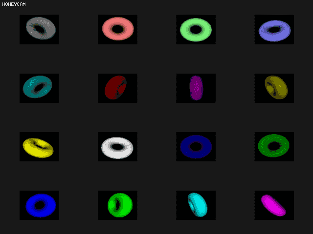

# Chapter 9 :: Fragment Processing & Framebuffer

## 9.1 Fragment Shader

쉐이더 코드가 각 프래그먼트의 색상을 결정하는 파이프라인 내 스테이지로, *FrameBuffer* 에 Composition (합성) 이 되기 전에 처리되는 단계이다. 각 프래그먼트 쉐이더에 대한 입력은 *Rasterizer* 에서 래스터화 되는 프리미티브들에 걸쳐서 선형적으로 부드럽게 보간된다. 이 때, *Rasterizer* 에서 *고정 함수* 에 의해 보간이 수행 될 때, ***보간을 어떻게 수행하고 심지어 수행할지 말지 여부를 결정할 수도 있다.***

### 보간 비활성화 시키기

기본적으로는 프리미티브에서 래스터화를 걸쳐서 입력되는 모든 멤버가 선형 보간이 되지만, **정수형 처럼 보간이 되지 말아야 하는 경우가 있다**. OpenGL 에서는 정수를 보간할 수 없기 때문에 정수에 대해서는 보간이 비활성화된다.

부동소수점 프래그먼트 쉐이더 입력의 보간을 명시적으로 비활성화 시킬 수도 있다. 보간이 **비활성화**된 프래그먼트 쉐이더 입력은 ***Flat input*** 이라고도 한다. (보통 쉐이더 입력의 보간이 적용된 것은 *Smooth input* 이라고 한다) 프래그먼트 쉐이더에 보간이 수행되지 않게 할려면 쉐이더 `in` 혹은 `varying` 앞에 ***`flat`*** 지시어를 붙인다.

``` glsl
flat in vec4 foo;
flat in int bar;
flat in mat3 baz;
```

반대로 명시적으로 선형 보간을 수행할려면 *`smooth`* 을 앞에 붙인다. 이 지시어들은 입력 블록`{}`에 대해서도 보간 지시어를 사용할 수 있으며, 입력 블록의 멤버 변수 각각 지시어를 사용해서 보간할 지 말지를 결정할 수 있다고 한다.

``` c++
flat in INPUT_BLOCK {
    vec4 foo;
    int bar4;
    smooth mat3 baz;
} // INPUT_BLOCK 의, baz 을 제외한 모든 멤버는 보간을 수행하지 않는다
```

여기서 이전 단계의 쉐이더 코드에서 선형 보간을 수행하지 않을 모든 출력 멤버에 대해서도 `flat` 지시어를 사용해서 명시적으로 보간하지 않음을 설정해줘야 한다.

만약 프래그먼트의 멤버가 보간이 되지 않을 때, 해당 `flat` 멤버의 값은 프리미티브를 구성하는 버텍스의 값 중 하나에서 올 수 있다. 문제는 프리미티브를 구성하는 정점의 개수가 2 개 이상이라면, 해당 정점들 중 첫번째 정점 혹은 마지막 정점 중 하나가 값을 가져올 정점으로 선택이 된다. 이를 ***Provoking vertex*** 이라고 한다.

*Provoking Vertex* 는 다음 함수와 열거형을 사용해서 첫번째 혹은 마지막 정점을 가져올 지 선택할 수 있다.

``` c++
void glProvokingVertex(GL_FIRST_VERTEX_CONVENTION | GL_LAST_VERTEX_CONVENTION);
```

## 9.2 Test for fragments

OpenGL 은 프래그먼트에 많은 테스트를 수행해서 실제 프레임버퍼에 써질지 말지, 혹은 어떻게 써 질지를 결정할 수 있다.

### 9.2.1 Scissor Test

#### A. Functions

*Viewport* 는 지오메트리를 직접 프론트엔드에서 클리핑하지만, ***Scissor Rectangle*** 은 Rasterization 이후에 따라올 처리의 일부로서 개별 프래그먼트를 가위 사각형에 대해 테스트한다.

이 때, OpenGL 은 가위 사각형들을 여러 개 설정할 수 있고, 배열을 지원한다. *SR* 을 설정하려면 다음과 같은 함수를 사용한다.

``` c++
void glScissorIndexed(index, left, bottom, width, height);
void glScissorIndexedv(index, const GLint* v);
```

두 함수에 대해 `index` 인자는 어떤 가위 사각형을 변경할 지 지정한다. `left` `bottom` `width` `height` 인자는 가위 사각형을 정의하는 윈도우 좌표 영역을 지정한다. 이 때 가위 테스트를 할 때는, 뷰포트의 영역에 있을 수 있도록 해야한다.

가위 사각형에 대해 선택하려면, **지오메트리 쉐이더의 gl_ViewportIndex** 내장 출력 변수를 사용한다.  (자세한 것은 코드를 보는 것이 좋을 듯) 가위 테스트를 활성화하려면 아래 함수를 호출한다.

``` c++
glEnable(GL_SCISSOR_TEST);
glDisable(GL_SCISSOR_TEST);
```

가위 테스트는 기본적으로 비활성화 되어 있고, 버퍼를 초기화 할 때도 가위 테스트는 비활성화 한 후에 하는 것이 좋다.

가위 테스트를 수행 시에, *Geometry shader* 에서는 `gl_InvocationID` 가 바인딩된 가위 테스트의 인덱스에 대해 순회되면서 호출된다. 만약 가위 사각형이 $ N $ 개 바인딩 되어 있으면, $ 0 $ 에서 $ N - 1 $ 까지 변수의 값이 증가한다.

#### B. Example

> Chapter9/_921_scissor.cc 을 참고한다.

#### SetupShaderProgram()

Scissor Test 에서는, *Geometry Shader* 의 `gl_InvocationID` 와 `gl_ViewportIndex` 을 사용해야 하므로, 지오메트리 쉐이더를 쉐이더에 링크시켜야 한다.

``` c++
constexpr const char* k_vs_path { "Chapter9/_921.vert" };
constexpr const char* k_gs_path { "Chapter9/_921.geom" };
constexpr const char* k_fs_path { "Chapter9/_921.frag" };

auto vert_shader { sb6::shader::load(k_vs_path, GL_VERTEX_SHADER) };
auto geom_shader { sb6::shader::load(k_gs_path, GL_GEOMETRY_SHADER) };
auto frag_shader { sb6::shader::load(k_fs_path, GL_FRAGMENT_SHADER) };
```

#### SetupBuffers()

*Geometry Shader* 코드의 내부를 보면, `gl_invocationID` 의 값으로 각각의 가위 사각형에 대해 시점이 다른 행렬을 곱할려고 하고 있는데, 4 개의 가위 사각형의 행렬이 들어가 있는 버퍼가 *Uniform buffer* 이다.

``` glsl
for (int i = 0; i < gl_in.length(); i++) {                                                
    gs_out.color = gs_in[i].color; 
    gl_Position = mvp_matrix[gl_InvocationID] * gl_in[i].gl_Position;          
    gl_ViewportIndex = gl_InvocationID; 
    EmitVertex();                                
} 
EndPrimitive();
```

이 때 mvp_matrix 유니폼 버퍼의 공간을 만들어주기 위해 버퍼를 바인딩하고 매 프레임마다 값을 변경하므로 (큐브의 모델 매트릭스까지 포함되어 있음) `GL_DYNAMIC_DRAW` 를 사용한다.

``` c++
glGenBuffers(1, &m_uniform_buffer);
glBindBuffer(GL_UNIFORM_BUFFER, m_uniform_buffer);
glBufferData(GL_UNIFORM_BUFFER, 4 * sizeof(vmath::mat4), nullptr, GL_DYNAMIC_DRAW);
```

#### render(double current_time)

화면 전체의 값을 초기화 할 때는 `glDisable(GL_SCISSOR_TEST)` 을 호출한 후에 버퍼를 초기화 해야한다. 만약 가위 테스트가 활성화된 상태로 초기화 하면, 버퍼 초기화가 제대로 작동하질 않는다.

그리고 본 렌더링을 실시하기 전에, `glEnable(GL_SCISSOR_TEST)` 으로 가위 테스트를 활성화시켜야 한다. 그렇지 않으면 각각의 회전하고 있는 정육면체 메쉬가 겹쳐보이는 현상이 일어나버린다. (가위 테스트가 먹히질 않는다)

그리고 Rasterization 후에 클리핑 처리될 *Scissor Rectangle* 을 4 개 만든다.

``` c++
// Set scissor rectangle onto viewport buffer.
glScissorIndexed(0, 0, 0, scissor_width, scissor_height);
glScissorIndexed(1, info.windowWidth - scissor_width, 0, scissor_width, scissor_height);
glScissorIndexed(2, 0, info.windowHeight - scissor_height, scissor_width, scissor_height);
glScissorIndexed(3, info.windowWidth - scissor_width, info.windowHeight - scissor_height, 
                 scissor_width, scissor_height);
```

마지막으로 매트릭스를 갱신하고 최종 렌더링한다. 매트릭스를 갱신할 때는 `UpdateProjectionMatrix` 멤버 함수를 사용한다. 여기서는 메모리에 얹혀진 *Uniform Buffer* 의 주소를 가져와서 값을 맵핑하는 식으로 매트릭스를 갱신한다.

``` c++
glBindBufferBase(GL_UNIFORM_BUFFER, 0, m_uniform_buffer);
// Map projection * view matrix for four scissored screen.
auto mv_matrix_array{ 
    static_cast<vmath::mat4*>(
        glMapBufferRange(GL_UNIFORM_BUFFER, 0, 4 * sizeof(vmath::mat4),
            GL_MAP_WRITE_BIT | GL_MAP_INVALIDATE_BUFFER_BIT)
    )
};

for (auto i = 0; i < 4; i++) {
    mv_matrix_array[i] = proj_matrix *
        vmath::translate(0.0f, 0.0f, -2.0f) *
        vmath::rotate((float)current_time * 45.0f * (float)(i + 1), 0.0f, 1.0f, 0.0f) *
        vmath::rotate((float)current_time * 81.0f * (float)(i + 1), 1.0f, 0.0f, 0.0f);
}

glUnmapBuffer(GL_UNIFORM_BUFFER);
```

결과는 다음과 같다.


### 9.2.2 Stencil Test

> Chapter 13. Stencil Testing.md 에서
>
> ...**Stencil Testing** 을 실행하게 된다. 이 테스트는 이전의 *Depth testing* 과 같이 무수한 프래그먼트 중 일부만을 골라내는 테스트이다. 따라서 이 테스트를 통과한 나머지 프래그먼트가 Depth test 을 거치게 되고 결과적으로 Screen 에 보이게 된다. 

만약 프레임 버퍼에서, 스텐실 버퍼를 가지고 있다면 해당 프레임 버퍼에 특정 오브젝트를 렌더링함으로써 오브젝트가 그려진 부분만을 마스킹하도록 할 수 있다.

#### A. Functions

스텐실 버퍼를 활성화시키기 위해서는 다음을 적는다.

``` c++
glEnable(GL_STENCIL_TEST);
```

그리고, 해당 프레임 버퍼에서 프레임 버퍼의 스텐실 값을 지우기 위해서는 다음과 같이 쓸 수 있다.

``` c++
glClear(GL_STENCIL_BUFFER_BIT);
```

그리고 스텐실 버퍼와 상호작용 하는 방법을 제어하기 위해서 OpenGL 은 두 가지 명령을 제공하고 있다.

* [**`glStencilFuncSeparate(face, func, ref, mask)`**](https://www.khronos.org/registry/OpenGL-Refpages/gl4/html/glStencilFuncSeparate.xhtml)

  `glStencilFunc(func, ref, mask)` 와 같지만, 위 함수는 GL_FRONT, GL_BACK, GL_FRONT_AND_BACK 중 하나를 지정해서 어떤 지오메트리에 대해 `func` `ref` 값, `mask` & 연산이 적용될 지를 OpenGL 에게 요청한다.

  * `func` :: Specifies the test function. Eight symbolic constants are valid: GL_NEVER, GL_LESS, GL_LEQUAL, GL_GREATER, GL_GEQUAL, GL_EQUAL, GL_NOTEQUAL, and GL_ALWAYS. The initial value is GL_ALWAYS. 자세한 설명은 위 함수를 참고한다.
  * `ref` : Specifies the reference value for the stencil test. ref is clamped to the range [0,2n−1], where n is the number of bitplanes in the stencil buffer. The initial value is 0. 
  * `mask` : 참조 값의 어떤 비트들이 버퍼의 값과 비교될 지를 제어한다. 

* [**`glStencilOpSeperate(face, sfail, dpfail, dppass)`**](https://www.khronos.org/registry/OpenGL-Refpages/gl4/html/glStencilOpSeparate.xhtml)

  `glStencilOp(sfail, dpfail, dppass)` 와 같지만 이 역시 위 함수와 같이 Face 을 설정가능 하다는 점에서 좀 더 세부적으로 설정이 가능하다. 이 함수는 스텐실 테스트가 통과하거나, Depth Test가 실패하거나, 모든 테스트를 통과시에 어떤 행동을 할지 OpenGL 에게 알리는 함수이다.

  각각 어떤 행동을 취할 수 있는 지는 스텐실 연산 열거형 변수를 통해 설정할 수 있으며, 이 함수는 위의 주소에서 확인이 가능하다.

  만약 스텐실 테스트 마저 실패하면, 프래그먼트가 바로 제거되고 더 이상의 작업은 수행되지 않을 것이다.

| Action         | Description                                                  |
| -------------- | ------------------------------------------------------------ |
| `GL_KEEP`      | The currently stored stencil value is kept.                  |
| `GL_ZERO`      | The stencil value is set to `0`.                             |
| `GL_REPLACE`   | The stencil value is replaced with the reference value set with glStencilFunc. |
| `GL_INCR`      | The stencil value is increased by `1` if it is lower than the maximum value. |
| `GL_INCR_WRAP` | Same as GL_INCR, but wraps it back to `0` as soon as the maximum value is exceeded. |
| `GL_DECR`      | The stencil value is decreased by `1` if it is higher than the minimum value. |
| `GL_DECR_WRAP` | Same as GL_DECR, but wraps it to the maximum value if it ends up lower than `0`. |
| `GL_INVERT`    | Bitwise inverts the current stencil buffer value.            |

> 참고로, Separate 가 붙지 않은 일반 함수는 자동으로 `GL_FRONT_AND_BACK` 을 적용한 것과 마찬가지이다.

#### B. 스텐실 버퍼 갱신 제어하기

스텐실 버퍼에 대한 **개별 비트의 갱신을 제어**하게 할 수도 있다. 

* [**`glStencilMaskSeparate(face, 8bit_mask)`**](https://www.khronos.org/registry/OpenGL-Refpages/gl4/html/glStencilMaskSeparate.xhtml)
  * `mask` :  Initially, the mask is all 1's. Specifies a bit mask to enable and disable writing of individual bits in the stencil planes.

### 9.2.3 Depth Test

#### A. Fundamental

스텐실 연산이 완료된 후에 깊이 연산이 활성화 된 상태이라면, OpenGL 은 프래그먼트의 깊이 값을 깊이 버퍼의 기존 값과 비교하는 Depth test 을 거친다. (물론 Geometry Shader 이전에 `gl_Position` 의 값이 최종적으로 끝난 상태라면, *early depth test* 을 수행하기도 한다.)

만약 *Depth Test* 가 실패하면, **프래그먼트는 폐기되고 다음 프래그먼트 연산으로 전달되지 않는다.** *Depth Test* 동안 OpenGL 은 현재 프래그먼트의 좌표에 해당하는 깊이 값 $ z $ 을 읽어서, 바인딩하고 있는 프레임버퍼의 *Depth Buffer (z-buffer)* 의 상응하는 위치에 저장된 $ z $ 값을 읽어 비교한다.

*Depth Test* 는 다음 함수를 사용해서 활성화 및 비활성화 할 수 있다.

``` c++
glEnable(GL_DEPTH_TEST);
glDisable(GL_DEPTH_TEST);
```

그리고, 다음 함수를 사용해서 프래그먼트가 깊이 테스트를 어떻게 통과할 지 설정할 수도 있다.

* [**`glDepthFunc(func_mode)`**](https://www.khronos.org/registry/OpenGL-Refpages/gl4/html/glDepthFunc.xhtml)

| Function      | Description                                                  |
| ------------- | ------------------------------------------------------------ |
| `GL_ALWAYS`   | The depth test always passes.                                |
| `GL_NEVER`    | The depth test never passes.                                 |
| `GL_LESS`     | Passes if the fragment's depth value is less than the stored depth value. |
| `GL_EQUAL`    | Passes if the fragment's depth value is equal to the stored depth value. |
| `GL_LEQUAL`   | Passes if the fragment's depth value is less than or equal to the stored depth value. |
| `GL_GREATER`  | Passes if the fragment's depth value is greater than the stored depth value. |
| `GL_NOTEQUAL` | Passes if the fragment's depth value is not equal to the stored depth value. |
| `GL_GEQUAL`   | Passes if the fragment's depth value is greater than or equal to the stored depth value. |

#### B. 깊이 버퍼 갱신 제어하기

* [**`glDepthMask(mask_flag)`**](https://www.khronos.org/registry/OpenGL-Refpages/gl4/html/glDepthMask.xhtml)
  * `flag` : `GL_FALSE` `GL_TRUE` 중 하나로, Depth Test 가 활성화 되었을 때 *z-buffer* 에 새로운 값을 갱신할 수 있도록 할지, 아닐 지를 정할 수 있다. 기본적으로 *GL_TRUE* 로 설정된다.

#### C. 깊이 고정

OpenGL 은 각 프래그먼트의 깊이 $ z $ 을 [0, 1] 까지의 유한한 부동소수점 값으로 표현한다. $ z $ 값이 이 범위 밖에 있는 프래그먼트의 경우에는 클리핑이 자연스럽게 된다. 하지만 이 클리핑을 끄고 임의의 깊이 값을 **[0, 1] 의 값으로 Clamp** 하는 옵션을 제공해주고 있다.

``` c++
glEnable(GL_DEPTH_CLAMP);
glDisable(GL_DEPTH_CLAMP);
```


## 9.3 색상 출력

색상 출력 스테이지는 OpenGL 파이프라인에서 *Fragment* 가 *Framebuffer* 에 쓰이기 전에, 최종적으로 어떤 색상을 정할 지 처리하는 마지막 부분이다.

### 9.3.1 Blending

> 기초적인 사항은 OpenGL Tutorial 의 Chapter 14. Blending.md 에서 확인할 수 있다.

#### A. Blending Functions

* [**`glBlendFuncSeparate(srcRGB, dstRGB, srcAlpha, dstAlpha)`**](https://www.khronos.org/registry/OpenGL-Refpages/gl4/html/glBlendFuncSeparate.xhtml)

  블렌딩 함수의 인자를 설정할 수 있다. 이 함수를 쓰면, $ RGB$ 와 $ Alpha $ 채널에 대해서 각각 다른 블렌딩 인자를 설정할 수 있다.

* `glBlendFunc(src, dst)` 

  Separate 와는 다르게 간단하게, $ RGBA $ 4 채널에 대해서 블렌딩 인자를 설정할 수 있다.

> 블렌딩 함수의 인자 리스트는 주소의 Parameter 테이블을 참고한다.

블렌딩 함수에 사용할 수 있는 원본 데이터는 4 가지가 존재한다. 하나는 첫 번째 원본 색상 ($ {RGBA}_{s0} $ ) 이며, 대상 색상 ( $ {RGBA}_{d} $ ) 이 존재한다. 나머지 두 개는 두 번째 원본 색상 ( $ {RGBA}_{s1} $ ) 과 상수 색상 (*Constant Color*) ( $ {RGBA}_{c} $ ) 이다.

여기서 상수 색상 ( $ {RGBA}_{c} $ ) 은 `glBlendColor(r, g, b, a)` 로 설정이 가능하다. 

#### B. [이중 원본 블렌딩 (Dual source blending)](https://www.khronos.org/opengl/wiki/Blending#Dual_Source_Blending)

Dual source blending refers to a blending mode, where the Fragment Shader outputs two colors to the same output buffer. To do this, the two outputs must both point to the same buffer index, but with a special parameter that refers to whether it is color 0 or color 1. This can be done in GLSL using the layout qualifier:

``` glsl
layout(location = 0, index = 0) out vec4 outputColor0;
layout(location = 0, index = 1) out vec4 outputColor1;
```

This has *outputColor0* writing to color 0 of buffer 0, while *outputColor1* goes to color 1 of buffer 0. Each buffer can have its own set of two colors.

Dual source blending is activated in a fragment shader by designating (via either method above) that at least one of the output values is going to color 1 of one of the destination buffers. When dual source blending is active for a shader, the number of color buffers that can be written to is no longer GL_MAX_DRAW_BUFFERS, but GL_MAX_DUAL_SOURCE_DRAW_BUFFERS. This implementation-dependent constant represents the number of draw buffers that a fragment shader can output to when using dual-source blending.

**Note:** In virtually every OpenGL implementation and hardware, GL_MAX_DUAL_SOURCE_DRAW_BUFFERS is 1. This applies to 3.x and 4.x hardware alike. For all practical purposes, if you use dual-source blending, you can only write to *one* buffer.

The source color **S** in blending equations is *always* color 0. Color 1 can only be used as a parameter. The parameters that use color 1 are GL_SRC1_COLOR, GL_SRC1_ALPHA, GL_ONE_MINUS_SRC1_COLOR, and GL_ONE_MINUS_SRC1_ALPHA.

> 참고서 번역 질이 매우 안 좋아서 원문을 그대로 긁어 쓰는 게 더 나았음.

#### C. Blending equation

블렌딩 인자를 설정한 뒤에, Source 및 Destination 인자를 어떻게 조합해서 최종 색상 값을 저장하게 할 지를 설정한다.

``` c++
glBlendEquation(GLenum mode);
glBlendEquation(GLenum rgb_mode, GLenum alpha_mode);
```

> 자세한 mode 인자들에 대해서는 다음 주소를 참고한다.
> https://www.khronos.org/registry/OpenGL-Refpages/gl4/html/glBlendEquation.xhtml

### 9.3.3 Color Masking

#### A. Definition

프래그먼트가 쓰이기 전에 마지막으로 수정할 수 있는 단계다. 이 단계에서는 색상 버퍼의 각 색상 채널에 대한 색상 갱신 여부를 끄고 킬 수 있다. (마스킹이 가능하다)

* [**`glColorMask(r, g, b, a)`**](https://www.khronos.org/registry/OpenGL-Refpages/gl4/html/glColorMask.xhtml)

  $ RGBA $ 각 채널에 GL_FALSE, GL_TRUE 을 써서 값 쓰기를 활성화시키거나 비활성화하도록 할 수 있다. 기본으로는 모두 GL_TRUE 로 쓰기가 활성화 되어있다.

  만약, 별도의 프레임 버퍼에서 여러 컬러 버퍼가 있을 때, 컬러 버퍼의 바인딩 인덱스에 따라 각 채널의 마스킹 (쓰기를 막는 것) 여부를 결정하고 싶다면, `glColorMaski(index, r, g, b, a)` 을 쓰면 된다.

#### B. 실제 예시?

> **Shadow volume** is a technique used in [3D computer graphics](https://en.wikipedia.org/wiki/3D_computer_graphics) to add shadows to a rendered scene.

*Shader volume* 에 깊이 정보를 채워넣고 싶을 때, 중요한 것은 깊이 정보 $ z $ 값 뿐이기 때문에 `glColorMask()` 로 색상 채널의 갱신을 막게 할 수도 있다.

또는 [Decal](https://www.google.com/search?client=firefox-b-ab&biw=1536&bih=781&tbm=isch&sa=1&ei=OR_pWvvxC8HJ0gTahJ7YBw&q=decal+glsl&oq=decal+glsl&gs_l=psy-ab.3...296.702.0.870.5.4.0.0.0.0.112.112.0j1.1.0....0...1c.1.64.psy-ab..4.0.0....0.e5vI07hWXBs#imgrc=YoTppy8aa5zOpM:) 을 바닥에 그리게 하고 싶으면, 깊이 쓰기를 비활성화 시켜서 `glDepthMask()`  깊이 데이터가 변경되는 것을 막을 수도 있다. (z-fighting 을 막을 수도?)

이 때 마스킹에서 중요한 점은, `gl` 함수를 사용해서 마스킹을 설정한 뒤에도 일반 렌더링을 바로 호출할 수 있다는 점이다. 마스킹을 적절하게 사용하면 특정 값을 쓰지 않기 하기 위해 쉐이더를 변경할 필요도 없으며 버퍼를 Detach 할 필요도 없고, 프레임 버퍼나 드로우 버퍼를 변경할 필요도 없게 된다.

## 9.4 Offscreen Rendering

> FrameBuffer 에 대한 또 다른 설명은 OpenGL Tutorial/Chapter 16. Framebuffers.md 을 참고한다.

### 9.4.1 Multiple Framebuffer Attachment

사용자 정의 프레임버퍼를 사용하면, 다중으로 버퍼를 붙일 수 있다. 즉, 여러 텍스쳐를 하나의 프레임버퍼에 어태치시켜서 하나의 쉐이더로 해당 텍스쳐들에 동시에 렌더링하게 할 수 있다. `glFramebufferTexture(target, attachment_mode, texture_id, level)` 에 `GL_COLOR_ATTACHMENTx` 와 같은 인자를 사용해서 프래그먼트를 한번 렌더링해서 각각의 버퍼에 각기 다른 결과값을 갱신하게 할 수도 있다.

예를 들면 다음과 같이 설정할 수 있다.

``` c++
constexpr GLenum draw_buffers[] {
    GL_COLOR_ATTACHMENT0, GL_COLOR_ATTACHMENT1, GL_COLOR_ATTACHMENT2
};

glGenFramebuffers(1, &fbo);
glBindFramebuffer(GL_FRAMEBUFFER, fbo);
glGenTextures(3, color_texture.data());
for (int i = 0; i < 3; ++i) {
    glBindTexture(GL_TEXTURE_2D, color_texture[i]);
    glTexImage2D(GL_TEXTURE_2D, 9, GL_RGBA8, 512, 512);
    
    /*! 기본 필터 인자를 설정한다.. */
    
    glFramebufferTexture(GL_FRAMEBUFFER, draw_buffers[i], color_texture[i], 0);
}

glGenTexture(1, &depth_texture);
glBindTexture(GL_TEXTURE_2D, depth_texture);
glTexImage2D(GL_TEXTURE_2D, 9, GL_DEPTH_COMPONENT32F, 512, 512);
glFramebufferTexture(GL_FRAMEBUFFER, GL_DEPTH_ATTACHMENT, depth_texture, 0);

glDrawBuffers(3, draw_buffers);
```

그리고 해당 프레임버퍼와 같이 사용하는 쉐이더에서는, `GL_COLOR_ATTACHMENT 0 1 2` 에 바인딩 된 각각의 컬러 버퍼에 '동시에' 색상 값을 갱신하는 것을 시도하기 위해 (마스킹이 되어있을지도 모르니까) 다음과 같이 프래그먼트 쉐이더 코드에 적는다. 

``` glsl
layout (location = 0) out vec4 color_0;	// to GL_COLOR_ATTACHMENT0
layout (location = 1) out vec4 color_1; // to GL_COLOR_ATTACHMENT1
layout (location = 2) out vec4 color_2; // to GL_COLOR_ATTACHMENT2
```

### 9.4.2 레이어 렌더링

**배열 텍스쳐 (Texture Array)** 란, 쉐이더에서 **인덱스**로 참조할 수 있는 2D 혹은 1D 텍스쳐들의 배열 집합이다. 배열 텍스쳐를 Framebuffer 객체에 붙이고, 지오메트리 쉐이더를 사용해서 어떤 레이어에 결과 프리미티브를 렌더링하게 할 지를 결정할 수 있다. 

#### A. 예제

이 예제는 16 개의 2D 텍스쳐를 컬러 버퍼로 바인딩하고, 배열로 바인딩해서 (`GL_TEXTURE_2D_ARRAY`) 지오메트리에서 `gl_InvocationID` 및 `gl_Layer` 라는 내장 변수를 사용해서 16 개의 버퍼에 텍스쳐 저장을 한 후, 이를 다시 실제 렌더링으로 보여주는 예제이다.

#### startup()

16 개의 최종 컬러 버퍼를, 2D 텍스쳐 배열로 만들기 위해서는 `glTexStorage3D` 와, *target* 을 `GL_TEXTURE_2D_ARRAY` 로 써서 $ N $ 층의 2D 레이어 버퍼를 만들 수 있다.

``` c++
glGenTextures(1, &array_texture);
glBindTexture(GL_TEXTURE_2D_ARRAY, array_texture);
glTexStorage3D(GL_TEXTURE_2D_ARRAY, 1, GL_RGBA8, 256, 256, 16);

glGenTextures(1, &array_depth);
glBindTexture(GL_TEXTURE_2D_ARRAY, array_depth);
glTexStorage3D(GL_TEXTURE_2D_ARRAY, 1, GL_DEPTH_COMPONENT32, 256, 256, 16);
```

이 경우, 컬러 버퍼가 될 버퍼의 내부 타입은 $ RGBA $ 8비트 총 4바이트의 정보를 가지며, 256 x 256 픽셀의 공간을 가지고 $ 16 $ 층의 레이어가 된다. 그리고 서브맵? 밉맵 수준은 1 단계로 설정한다.

*Depth buffer* 의 경우에도 각 층마다 만들어야 하는데, 이 때는 각 픽셀의 정보는 4 Byte 부동소수점 형을 가진다.

``` c++
glGenFramebuffers(1, &m_layered_fbo);
glBindFramebuffer(GL_FRAMEBUFFER, m_layered_fbo);
glFramebufferTexture(GL_FRAMEBUFFER, GL_COLOR_ATTACHMENT0, array_texture, 0);
glFramebufferTexture(GL_FRAMEBUFFER, GL_DEPTH_ATTACHMENT, array_depth, 0);
```

그리고 커스텀 프레임 버퍼에 어태치먼트를 정해서 바인딩 한다. $ 0 $ 의 의미는, 해당 밉맵 수준에서 1 번째 수준을 사용하겠다는 것이다. `GL_TEXTURE_2D_ARRAY` 로 **레이어드 컬러 버퍼**를 만든 경우에는 `GL_COLOR_ATTACHMENT0` 을 설정해주면, $ 0 $ 에서 $ N $ 까지 연속적으로 인덱스를 가지게 된다. 이렇게 되면, 나중에 *Geometry shader* 에서 `gl_Layer` 및 `gl_InvocationID` 으로 연속된 레이어 버퍼 중 임의 버퍼에 프리미티브를 출력할 수 있다.

#### render()

##### UpdateMatrixBuffers()

`GL_UNIFORM_BUFFER` 로 16 개의 렌더링 시도마다 각기 다른 PVM 매트릭스를 적용하고자 바인딩 된 *m_transform_ubo* 에 대해서 `glMapBufferRange()` 로 값을 다시 새로 맵핑한다. 해당 변수는 지오메트리 쉐이더 코드의 블록 인터페이스와 같은 바이트 구조를 가진다.

``` c++
layout (binding = 0) uniform BLOCK {
    mat4 proj_matrix;
    mat4 mv_matrix[16];
};
```

##### RenderLayerFragments()

이 함수에서는 $ 16 $ 개의 레이어드 컬러 버퍼에 `gl_Layer` `gl_InvocationID` 을 사용해서 각각 프리미티브를 전송해 오프스크린 렌더링을 하도록 한다. 이 때 컬러 버퍼의 첫 위치는 `GL_COLOR_ATTACHMENT0` 에 바인딩 되어 있으므로 `glDrawBuffers()` 을 통해서 해당 버퍼에 그리겠음을 바인딩해줘야 한다.

* [**`void glDrawBuffer(GLenum buf)`**](https://www.khronos.org/registry/OpenGL-Refpages/gl4/html/glDrawBuffer.xhtml)

  specify which color buffers are to be drawn into. 
  The initial value is GL_FRONT for single-buffered contexts, and GL_BACK for double-buffered contexts. For framebuffer objects, GL_COLOR_ATTACHMENT$m$ and GL_NONE enums are accepted, where $m$ is a value between 0 and GL_MAX_COLOR_ATTACHMENTS.

##### in gslayers.gs.glsl

우선, $ 16 $ 개의 버퍼에 프리미티브를 전송해야 하기 때문에, `varying` 으로 정점의 그룹을 읽어올 때 `invocations = 16` 으로 설정하여 삼각형 정점 그룹을 16 번 가져오도록 한다.

``` c++
layout (invocations = 16, triangles) in;
layout (triangle_strip, max_vertices = 3) out;
```

그리고 *main* 함수에서는 출력될 정점의 내장 변수인 `gl_Layer` 을 `gl_InvocationID` 로 설정해서, *GL_COLOR_ATTACHMENT0* 에서 주욱 내려가는 컬러 버퍼에 정점 출력을 하고, 최종적으로 삼각형 프리미티브를 출력할 수 있도록 한다.

``` c++
for (i = 0; i < gl_in.length(); i++) {
    gs_out.color = colors[gl_InvocationID];
    gs_out.normal = mat3(mv_matrix[gl_InvocationID]) * gs_in[i].normal;
    gl_Position = proj_matrix * mv_matrix[gl_InvocationID] * gl_in[i].gl_Position;
    gl_Layer = gl_InvocationID;
    EmitVertex();
}
EndPrimitive();
```

##### 본 함수

렌더링을 해서 $ 16 $ 개의 버퍼에 오프스크린 렌더링을 한 이후에는, 이것을 실제 후면 버퍼에 렌더링해서 화면에 표시해야 한다. 여기서 `glDrawBuffer` 함수로 `GL_COLOR_ATTACHMENT0` 을 `GL_BACK` 으로 되돌린다. 또한, `glBindTexture(GL_TEXTURE_2D_ARRAY, array_texture)` 으로 현재 만들어진 *layered color buffer* 을 바인딩해서 쉐이더에서 쓸 수 있도록 한다.

그리고 *Instancing* 을 통해 `gl_InstanceID` 을 쉐이더의 텍셀의 $ z $ 값으로 지정하게 함으로써 레이어드 컬러 버퍼의 층에 존재하는 적절한 텍셀을 프래그먼트 쉐이더에서 찾을 수 있도록 한다.

        glBindTexture(GL_TEXTURE_2D_ARRAY, array_texture);
        glDisable(GL_DEPTH_TEST);
    
        glBindVertexArray(vao);
        glDrawArraysInstanced(GL_TRIANGLE_FAN, 0, 4, 16)
``` c++
int iid = gl_InstanceID;
// Do something...
vs_out.tc = vec3(vertices[vid].xy + vec2(0.5), float(iid))
```

따라서 다음과 같은 결과를 얻을 수 있다.



#### B. 3D 텍스쳐로 렌더링하기?

3D 텍스쳐로 렌더링 하는 방식도 위와 거의 동일하다. 3D 텍스쳐를 가져온 뒤에 이것을 프레임버퍼의 `GL_COLOR_ATTACHMENT0` 에 바인딩해서 `gl_Layer` 출력을 정하면 된다. 이 때 `gl_Layer` 에 쓰는 값은 3D 텍스쳐 슬라이스의 $ z $ 값이 된다.

동일한 텍스쳐의 여러 슬라이스 (레이어드 컬러 버퍼 등) 에 동시에 렌더링하는 것도 가능한데 이 경우에는 다음과 같은 함수를 호출한다.

``` c++
void glFramebufferTextureLayer(GLenum target,
  	GLenum attachment,
  	GLuint texture,
  	GLint level,
  	GLint layer);
```

> https://www.khronos.org/registry/OpenGL-Refpages/gl4/html/glFramebufferTextureLayer.xhtml

이 함수는 `glFramebufferTexture` 와 비슷하지만, layer 의 개념이 추가되었으며 따라서 `GL_TEXTURE_2D_ARRAY` 와 같은 레이어드 버퍼의 각 레이어 인덱스를 적어서 어태치먼트를 붙일 수 있다.

### 9.4.3 Framebuffer Completeness

*FBO* 가 제대로 설정이 잘 되었는지를 확인하기 위해서는 *프레임버퍼 완전성* 을 확인하는 수 밖에 없다. 이 완전성은 *Texture Completeness* 와 동일하며, 텍스쳐에 필요한 모든 밉맵 레벨을 지정된 크기, 포맷 등으로 설정하지 않았다면 그 텍스쳐는 불완전하며 사용될 수 없다는 것과 비슷한 기준을 가진다.

#### Attachment Completeness

어태치먼트가 완전하지 않은 경우에는 다음과 같은 상황이 있을 때 완전함이 충족되지 않는다.

* 이미지가 어태치된 객체에 연결되지 않았다.
* 어태치된 이미지의 넓이나 높이가 0 이다.
* 비색상 렌더링 포맷이 색상 어태치먼트에 연결되었거나, 비깊이 포맷이 깊이 어태치먼트에 연결되었다.
* 스텐실 포맷 역시 다른 어태치먼트에 연결된 경우.

불완전함이 발생한다.

#### Total Framebuffer Comp

* glDrawBuffers() 로 출력을 어태치했지만, 이미지가 어태치 되지 않은 경우
* 내부 포맷의 조합을 드라이버에서 지원하지 않는 경우

#### 프레임버퍼 확인하기

An FBO that is valid for use is said to be "framebuffer complete". To test framebuffer completeness, call this function:

```
 GLenum glCheckFramebufferStatus(GLenum target);
```

You are not required to call this manually. However, using an incomplete FBO is an error, so it's always a good idea to check.

The return value is GL_FRAMEBUFFER_COMPLETE  if the FBO can be used. If it is something else, then there is a  problem. Below are the rules for completeness and the associated return  values you will receive if they are not followed.

만약 위 함수를 써서 `GL_FRAMEBUFFER_COMPLETE` 가 나오지 않았다면 다음 함수를 통해서 세부 사항을 확인할 수 있다.

``` c++
GLenum glCheckFramebufferStatus(GLenum target);
```

> https://www.khronos.org/opengl/wiki/GLAPI/glCheckFramebufferStatus

## 9.5 Anti-aliasing

> 9.4.4 Stereo rendering 은 하드웨어에서 지원하지 않는 관계로 넘어감.

다운 샘플링을 할 때 생기는 계단 현상 등을 제거하거나 줄이는 방법을 *Anti-aliasing* 기법이라고 한다.

### 9.5.1 Using filtering 

*AA* 을 적용하는 방법 중 하나는 `glEnable(GL_LINE_SMOOTH | GL_POLYGON_SMOOTH)` 을 사용해서 프리미티브를 렌더링 할 때 필터링 하는 방법이다. 이 방법을 사용하면 OpenGL 은 프리미티브가 차지하는 픽셀의 양을 계산해서 적절한 알파값을 생성한다. 그 후에 쉐이더에서 생성한 알파값과 다시 곱해져 블렌딩 효과를 주게 된다.

이 때 덤으로 필요한 것은 블렌딩 기능을 활성화 시키고, 블렌딩 함수를 설정해야 한다는 것이다.

``` c++
glEnable(GL_BLEND);
glBlendFunc(GL_SRC_ALPHA, GL_ONE_MINUS_SRC_ALPHA);
glEnable(GL_POLYGON_SMOOTH);
```

하지만 이 경우에는 큰 단점이 존재한다. 다음과 같이 가장자리가 부드럽게 나오는 것은 좋으나,


두 개의 삼각형이 인접하고 있는 가장자리 부근에서 선이 생기는 것을 확인할 수 있다.

왜냐면 이는 필터링을 통한 *AA* 을 구현할 때 알파값의 블렌딩을 통해서 가장자리를 부드럽게 한다는 개념에서 발생하는 오류인데, 두 인접 삼각형 사이의 가장자리의 픽셀이 각각의 프리미티브가 정확히 반을 차지한다고 하면 알파값이 $ 1.0 $ 이 되는 것이 아니라 서로 곱해지고 더해져서 최종 $ 0.75 $ 알파값의 회색이 되버린다.

폴리곤 가장자리가 픽셀을 통과하고 화면에 렌더링 될 때 마다, OpenGL 은 **어떤 부분이 픽셀을 차지하고 그렇지 않은지를 전부 확인할 수 있는 방법이 존재하지 않는다.** 아무튼 이러한 문제를 해결하기 위해서는 **픽셀의 샘플링 수를 늘리는 (물리적이든 어떻게 되든)** 방법을 써서 *AA* 을 구현할 수 있다.

### 9.5.2 MSAA

> https://www.khronos.org/opengl/wiki/Multisampling

이미지의 샘플율을 증가시키기 위해 OpenGL 은 화면 상의 각 픽셀에 대해 여러 샘플을 저장하는 방식을 지원한다. 이 기법을 **MSAA (Multisample Anti-aliasing)** 이라고 한다. 각 프리미티브를 한 번만 샘플링 하지 않고, OpenGL 은 픽셀 안의 여러 위치에서 프리미티브를 샘플링하고자 한다.

만약 그 중에서 프리미티브가 존재하는 임의 위치에 대해 쉐이더를 실행하고, 쉐이더가 생성한 색상은 픽셀 내의 임의 위치에 존재하는 샘플 모두에 써지게 된다.

*Multi sample framebuffer* 을 만들면 멀티 샘플링이 자동으로 활성화된다. 하지만 멀티 샘플 프레임버퍼를 사용하면서도 *MSAA* 을 사용하고 싶지 않을 때는 다음과 같이 `glEnable` 을 사용해서 키고 끌 수 있다.

``` c++
glEnable(GL_MULTISAMPLE);
glDisable(GL_MULTISAMPLE);
```

### 9.5.3 Multi-sample texture

### 9.5.4 샘플별 쉐이딩

### 9.5.5 중심 샘플링


## 9.6 고급 프레임버퍼 포맷

윈도우 시스템에서 제공하고 있는 기존 프레임 버퍼나, 사용자 정의 프레임 버퍼에 텍스쳐를 렌더링 할 때는 대개 컬러 버퍼의 *type* 이 `GL_RGBA8` 와 같은 각 채널 당 $ N $ 비트 정수형 포맷으로 구성된다. 하지만 쉐이더에서는 컬러 값을 출력할 때, `vec4 float` 으로 넘기는 걸 자연스럽게 확인할 수 있다.

사실 OpenGL 은 프레임버퍼의 각 버퍼의 픽셀 타입을 *부동소수점 형태, 정수형, 음수, 8비트보다 큰 수* 등으로 설정해서 값을 갱신하도록 할 수 있다.

### 9.6.1 Rendering without any attachment

프레임버퍼를 하나 생성해서, *아무것도 어태치 시키지 않고* 쉐이더를 사용하는 것도 가능하다. 하지만 이 경우에는 출력된 데이터가 저장될 곳이 없기 때문에 폐기된다. 하지만 프래그먼트 쉐이더는 그냥 텍스쳐 버퍼에 쓰는 것 외에도 **`imageStore()`** 와 같은 내장 함수를 사용해서 지정된 이미지 (`gimage`) 에 텍셀의 값을 저장할 수도 있고 *atomic* 한 연산을 사용해서 카운터를 증가시키거나 감소할 수도 있다.

> imageStore
> https://www.khronos.org/registry/OpenGL-Refpages/gl4/html/imageStore.xhtml
> https://computergraphics.stackexchange.com/questions/4388/binary-scene-voxelization-using-imagestore-problem
>
> atomicCounterIncrement
> https://www.khronos.org/registry/OpenGL-Refpages/gl4/html/atomicCounterIncrement.xhtml
> http://www.geeks3d.com/20120309/opengl-4-2-atomic-counter-demo-rendering-order-of-fragments/

보통 렌더링을 할 때, 바인딩 된 프레임 버퍼에서는 하나 이상의 어태치먼트에 바인딩 된 버퍼의 *최대 넓이, 높이, 레이어 수, 샘플 개수* 등을 가져와서 렌더링하는데 정보로 쓴다. 이런 속성들은 뷰포트를 정의하는 크기 등 여러가지 설정에서 쓰일 수 있다.

#### A. Functions

하지만 프레임버퍼에서 **Attachment 가 없다면, 텍스쳐 메모리의 양의 제한이 없어질 수 있다.** 그러나 해당 프레임버퍼는 이 정보를 다른 곳으로부터 얻어와야 한다. 

각 프레임버퍼 객체는, Attachment 가 없으면 **인자 값을 직접 설정**해줘야 한다. 이런 인자들을 수정하기 위해서는 다음과 같은 함수를 사용한다.

``` c++
void glFramebufferParameteri(GLenum target, GLenum pname, GLint param);
```

* `target` : 어떤 프레임버퍼 객체가 바인딩이 될지 결정한다. `GL_FRAMBUFFER` `GL_DRAW_` `GL_READ_` 등이 바인딩될 수 있다. 이 때 일반 인자는 `_DRAW_` 와 동일하다는 것을 알아두자.

* `pname` : 어떤 인자를 변경할지 지정한다.

  > 인자는 다음 주소에서 찾아볼 수 있다.
  > https://www.khronos.org/registry/OpenGL-Refpages/gl4/html/glFramebufferParameteri.xhtml

* `param` : 해당 인자에 대해 변경할 값을 지정할 수 있다.

어태치먼트가 없는 프레임버퍼의 최대 크기는 매우 커질 수 있다. 왜냐면 실제로 렌더링할 어태치먼트가 없기 때문이다.

#### B. Example

다음은 예시 코드이다. 프레임버퍼를 하나 생성해서, 가상으로 10000 x 10000 의 버퍼가 있다고 알리는 코드이다.

``` c++
glGenFramebuffers(1, &m_fbo);
glBindFrameBuffer(GL_FRAMEBUFFER, m_fbo);
glFramebufferParameteri(GL_FRAMEBUFFER, GL_FRAMEBUFFER_DEFAULT_WIDTH, 10'000);
glFramebufferParameteri(GL_FRAMEBUFFER, GL_FRAMEBUFFER_DEFAULT_HEIGHT, 10'000);
```

이렇게 하면 `gl_FragCoord` 의 변수의 요소 $ (x, y) $ 는 $ 0 $ 에서 $ 9,999 $ 까지 될 것이다.

### 9.6.2 floating-point framebuffer

프레임버퍼에서 부동소수점 포맷의 어태치먼트를 사용하게 할 수도 있다. 사실, OpenGL 렌더링 파이프라인은 내부적으로 부동소수점 데이터와 잘 작동하지만 원본과 타깃은 기껏해야 고정소수점 포맷을 사용한다. 따라서 최종적으로는 모든 값이 $ 0 $ 에서 $ 1 $ 사이로 고정된다.

그래서 컬러 (색상) 및 쉐이딩에 일반 32비트 부동소수점을 사용하게 할 수도 있다. 하지만 만약 색상 당 8비트만을 지원하는 모니터에서 렌더링하게 되면 고정 소수점으로 맵핑이 되면서 값 정보가 날아가버린다. 그렇지만 **부동소수점 정밀도로 텍스쳐에 렌더링하거나, 부동 데이터가 고정 소수점 출력 포맷에 어떻게 매핑되는지도 제어할 수 있다.**

이렇게 부동소수점 포맷을 이용해서 렌더링을 실시하는 행위를 ***HDR(High dynamic-range)*** 이라고 한다.

#### A. 부동소수점 포맷 사용하기

부동소수점 포맷의 버퍼를 사용하기 위해서는 `glTexStorage2D` 와 같은 함수에서 내부 포맷을 `GL_RGBA32F` `GL_RGBA16F` 와 같은 것으로 생성하면 된다.

``` c++
glTexStorage2D(GL_TEXTURE_2D, 1, GL_RGBA16F, width, height);
glTexStorage2D(GL_TEXTURE_2D, 1, GL_RGBA32F, width, height);
```

여기서 부동소수점 포맷은 *suffix* `F` 가 붙음을 알아야 한다.

> 다음 주소에서 부동소수점 포맷 리스트를 확인할 수 있다.
> https://www.khronos.org/registry/OpenGL-Refpages/es3.0/html/glTexImage2D.xhtml

#### B. HDR (high dynamic range)

*HDR* 을 사용해서 *light bloom, lens flare, light reflection, light refaction, sunset light, dust, particle* 등의 여러 고급 효과들을 구현할 수 있다. 부동소수점 버퍼에 대한 *HDR* 은, **밝은 부분을 밝게, 어두운 부분을 더 어둡게 하면서도 디테일을 함께 볼 수 있**도록 한다. 

단일 이미지에 어둡고 밝은 영여에 대해서 모든 디테일을 저장할 수 있는 것은 부동소수점 데이터를 사용하기 때뭉니다. 하지만 이 부동소수점의 이미지를 0 에서 255 의 값으로 표시되는 동적 이미지로 생성할려면 (트루컬러) ***tone mapping*** 을 사용해서 수행할 수 있다.

#### C. Tone mapping

일반 컴퓨터에서는 부동소수점 데이터를 디스플레이에 표현할 수 없기 때문에 표시할 수 있는 색상으로 **Tone mapping** 을 수행해야 한다. *Tone Mapping* 은 일련의 색상 데이터를 다른 색상 데이터 혹은 다른 색상 공간으로 옮기는 작업을 말한다.

#### D. Tone mapping example

